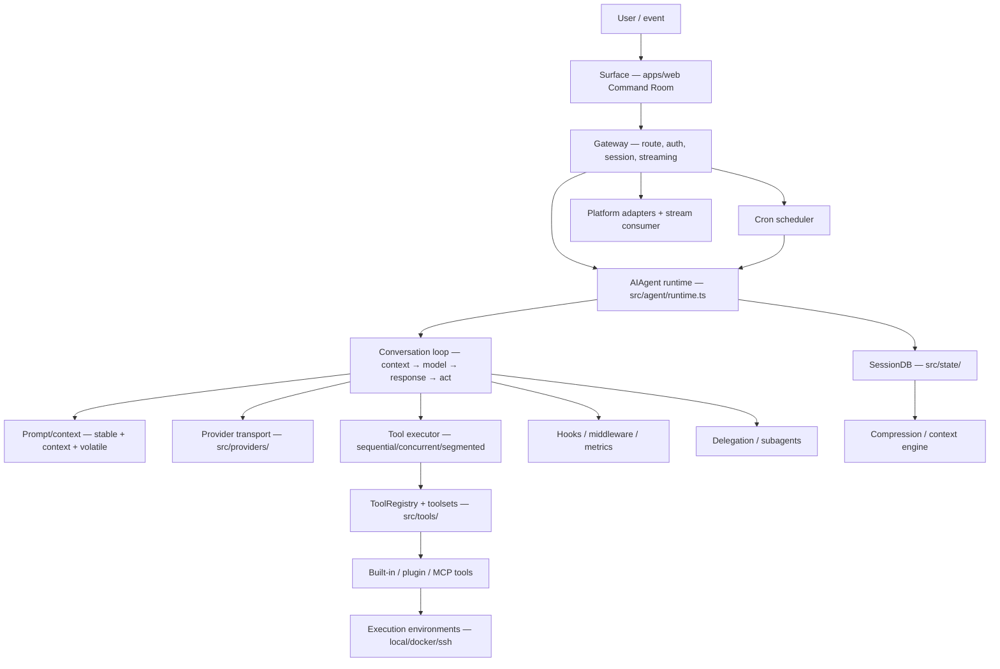

# PAAX Command Room Worker — Architecture Layers

Dokumen ini adalah peta arsitektur kanonik untuk worker Command Room. Ia
memetakan lapisan Hermes dari hierarki utama ke modul PAAX aktual, menetapkan
runtime home di `services/ai-orchestrator`, dan membedakan file yang sudah ada
(`ADA`/`ADA-PARSIAL`) dari lokasi scaffolding atau target phase berikutnya
(`BARU`). Phase 1 hanya membuat fondasi dan stub; tabel ini tidak menyatakan
bahwa implementasi Phase 2–6 sudah tersedia.

## Diagram aliran lapisan

Interpretasi lapisan mengikuti audit Hermes: provider menghasilkan respons,
loop menentukan siklus, tool executor menjalankan kemampuan, dan surface atau
gateway menghubungkan manusia dengan runtime. Sandbox/environment adalah batas
eksekusi, bukan nama lain untuk agent loop. `apps/web` tetap surface + gateway;
runtime agent kanonik berada di service.

## Pemetaan 16 lapisan

| # | Lapisan Hermes | Modul PAAX | File/direktori kanonik | Status | Batas Phase 1 |
| ---: | --- | --- | --- | --- | --- |
| 1 | Surface (web Command Room) | `apps/web` | `apps/web/src/app/(dashboard)/command-room/page.tsx`; `apps/web/src/components/command-room/{command-room-work.tsx,command-room-ui.ts,RunStatus.tsx}` | ADA | Tidak diubah; surface tidak membuat loop model kedua |
| 2 | Gateway / route / session / streaming | service + web | `services/ai-orchestrator/src/gateway/{run.ts,session.ts,stream-consumer.ts,config.ts}`; `apps/web/src/app/api/command-room/**` | ADA-PARSIAL → BARU di service | Route web tetap hidup; scaffold service hanya menetapkan lokasi |
| 3 | AIAgent runtime | `services/ai-orchestrator` | `services/ai-orchestrator/src/agent/runtime.ts` | BARU | Stub Phase 2; belum façade runtime |
| 4 | Conversation loop | `services/ai-orchestrator` | `services/ai-orchestrator/src/agent/conversation-loop.ts` | BARU | Stub Phase 3; tidak menyentuh loop web/Gemini |
| 5 | Prompt / context | `services/ai-orchestrator` | `src/agent/{prompt-builder.ts,system-prompt.ts,context-files.ts,turn-context.ts}` | BARU | Stub Phase 2–5 |
| 6 | Provider transport | `services/ai-orchestrator` | `src/providers/{base.ts,index.ts}`; `src/providers/transports/README.md` (target transport Phase 3) | BARU | `gemini/` dibekukan; tidak ada transport baru |
| 7 | Tool executor | `services/ai-orchestrator` | `src/agent/tool-executor.ts` | BARU | Stub Phase 3; executor existing tetap tidak diubah |
| 8 | ToolRegistry + toolsets | `services/ai-orchestrator` | Existing `src/tools/registry.ts`; target `src/tools/{model-tools.ts,toolsets.ts}` | ADA-PARSIAL | Registry existing tidak diubah; satu registry kanonik adalah aturan target |
| 9 | Built-in / plugin / MCP tools | `services/ai-orchestrator` | Existing `src/tools/*`; target `src/tools/{skills-tool.ts,skills-guard.ts,skill-manager-tool.ts,delegate-tool.ts,approval.ts,threat-patterns.ts,mcp/}` dan `src/plugins/` | ADA-PARSIAL | Hanya lokasi/stub baru; tidak ada plugin/MCP runtime |
| 10 | Sandbox / execution environment | `services/ai-orchestrator` | `src/tools/environments/{base.ts,local.ts,docker.ts,ssh.ts}` | BARU | Stub Phase 4; `agentic/budget-sandbox.ts` bukan exec sandbox |
| 11 | SessionDB (SQLite WAL + FTS5 + lineage) | `services/ai-orchestrator` | `src/state/{session-db.ts,schema.ts,search.ts}` | BARU | Stub Phase 4/6; keputusan dependency SQLite ditunda |
| 12 | Compression / context engine | `services/ai-orchestrator` | `src/agent/{context-engine.ts,context-compressor.ts,memory-manager.ts}` | BARU | Stub Phase 6; router memory tetap existing |
| 13 | Hooks / middleware / metrics | `services/ai-orchestrator` | `src/plugins/middleware.ts`; target `src/agent/monitoring/` | BARU | Middleware belum diimplementasikan; event bus existing dibiarkan |
| 14 | Delegation / subagents | `services/ai-orchestrator` | `src/agent/subagent-lifecycle.ts`; `src/tools/delegate-tool.ts` | BARU | Stub Phase 6; tidak ada child-agent loop |
| 15 | Cron | `services/ai-orchestrator` | `src/cron/{jobs.ts,scheduler.ts}` | BARU | Stub Phase 4/6; tidak ada scheduler aktif |
| 16 | Platform adapters + stream consumer | `services/ai-orchestrator` | `src/gateway/platforms/` + `src/gateway/stream-consumer.ts` | BARU | README/stub lokasi saja; adapter Phase 6 |

`src/providers/transports/`, `src/gateway/platforms/`, `src/skills/`, dan
`src/tools/mcp/` adalah boundary direktori Phase 1. Implementasi file adapter,
transport, atau server di dalamnya bukan bagian phase ini.

## Pemetaan 11 hub Hermes

| # | Hub Hermes | File PAAX kanonik | Status | Relasi tanggung jawab |
| ---: | --- | --- | --- | --- |
| 1 | `gateway.config.PlatformConfig` | `services/ai-orchestrator/src/gateway/config.ts` | BARU | Konfigurasi gateway, platform, auth, dan delivery |
| 2 | `hermes_state.SessionDB` | `services/ai-orchestrator/src/state/session-db.ts` | BARU | State durable, WAL/FTS5, lineage, dan search |
| 3 | `run_agent.AIAgent` | `services/ai-orchestrator/src/agent/runtime.ts` | BARU | Runtime façade dan lifecycle run |
| 4 | `gateway.run.GatewayRunner` | `services/ai-orchestrator/src/gateway/run.ts` | BARU | Menjembatani session, runtime, event, dan delivery |
| 5 | `hermes_cli.config.load_config` | `services/ai-orchestrator/src/config.ts` (`loadConfig`) | ADA | Sumber konfigurasi existing; tidak diubah |
| 6 | `hermes_constants.get_hermes_home` | `services/ai-orchestrator/src/constants.ts` | BARU | Resolver root/profile/cache/runtime directory |
| 7 | `agent.context_compressor.ContextCompressor` | `services/ai-orchestrator/src/agent/context-compressor.ts` | BARU | Kompresi context dan pengelolaan token |
| 8 | `hermes_cli.plugins.PluginManager` | `services/ai-orchestrator/src/plugins/manager.ts` | BARU | Lifecycle dan registrasi plugin |
| 9 | `tools.mcp_tool.MCPServerTask` | `services/ai-orchestrator/src/tools/mcp/server-task.ts` | BARU target | Server task MCP; Phase 5, belum dibuat di Phase 1 |
| 10 | `model_tools.get_tool_definitions` | `services/ai-orchestrator/src/tools/model-tools.ts` | BARU | Definisi tool untuk provider model |
| 11 | `toolsets` | `services/ai-orchestrator/src/tools/toolsets.ts` | BARU | Komposisi availability dan capability tool |

## Aturan arsitektur kanonik

1. **Satu loop LLM kanonik.** Hanya `src/agent/conversation-loop.ts` yang
   nantinya boleh mengulang request model. Route web meneruskan event ke runtime;
   `gemini/` dan implementasi chat existing tidak digabung atau diubah di Phase 1.
2. **Satu registry tool.** `src/tools/registry.ts` adalah boundary registry
   kanonik; `model-tools.ts` membentuk definisi provider dan `toolsets.ts`
   membatasi capability. Migrasi registry existing dilakukan pada phase yang
   merencanakannya, bukan dengan membuat registry keempat.
3. **Provider bermuara di `providers/`.** Transport baru kelak diletakkan di
   `src/providers/transports/`; direktori `src/gemini/` adalah transport legacy
   yang dibekukan sampai Phase 6.
4. **SessionDB tunggal.** `src/state/` adalah target durable. JSON store,
   in-memory store, dan localStorage existing tetap menjadi jalur existing atau
   migrasi sampai phase konsolidasi.
5. **Persist sebelum side effect.** Loop target harus menyimpan intent/record
   sebelum side effect agar retry dan recovery dapat diaudit.
6. **Approval fail-closed.** `agentic/approval-service.ts`, security, budget,
   idempotency, dan path-safety existing dipertahankan serta diperluas pada
   phase implementasi. Override full AI agent tidak mengizinkan penghapusan
   guardrail keselamatan.
7. **Tidak membuat loop ketiga.** Stub Phase 1 hanya menetapkan boundary dan
   tidak boleh mengandung request model, retry loop, tool dispatch, persistence,
   provider call, atau side effect.

## Batas implementasi Phase 1

Yang dibuat pada phase ini hanya dokumen peta serta scaffolding `export {}` dan
README di runtime home. Conversation loop, runtime façade, provider transport,
SessionDB SQLite, sandbox backend, cron, delegation, plugin, MCP, dan migrasi
web→service tetap berada di Phase 2–6 sesuai master plan.
