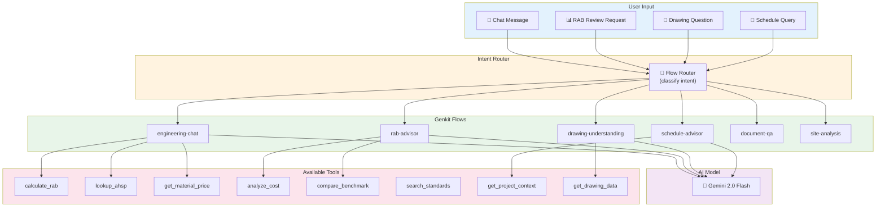

# PAAX AI — AI Orchestrator API Documentation

> API reference untuk AI Orchestrator (Firebase Genkit / TypeScript).
> Service ini mengelola semua interaksi AI: chat, advisory, dan document understanding.

**Base URL**: `http://localhost:3400` (development) | `https://ai-orchestrator-xxxxx.run.app` (production)

---

## 1. Overview

AI Orchestrator adalah **pusat koordinasi AI** di PAAX AI. Dibangun dengan Firebase Genkit,
service ini mengelola:

- Flow routing (memilih flow yang tepat berdasarkan intent)
- Tool calling (memanggil Core Engine untuk data/kalkulasi)
- Context assembly (mengumpulkan konteks proyek untuk LLM)
- Prompt management (template prompt yang terstruktur)
- Streaming responses (SSE untuk real-time chat)



---

## 2. Authentication

Same as Core Engine — Firebase Auth JWT token required:

```http
Authorization: Bearer <firebase-jwt-token>
X-Project-Id: <project-id>
Content-Type: application/json
```

---

## 3. Flows

### 3.1 Engineering Chat

**Endpoint**: `POST /flow/engineering-chat`

**Description**: Flow utama untuk percakapan teknis. Bisa menjawab pertanyaan umum konstruksi,
mengakses data proyek melalui tools, dan membantu revisi RAB.

**Input**:
```json
{
  "projectId": "proj_abc123",
  "threadId": "thread_xyz",
  "message": "Kenapa biaya pekerjaan struktur sangat tinggi? Bisa breakdown detail?",
  "context": {
    "rabVersionId": "rab_v3_xyz",
    "activeFileIds": ["file_001", "file_002"]
  },
  "stream": true
}
```

**Output** (streamed via SSE):
```
event: token
data: {"content": "Berdasarkan "}

event: token
data: {"content": "RAB v3 proyek "}

event: tool_call
data: {"tool": "analyze_cost", "input": {"rabId": "rab_v3_xyz", "division": "struktur"}}

event: tool_result
data: {"tool": "analyze_cost", "result": {"breakdown": [...]}}

event: token
data: {"content": "Biaya pekerjaan struktur sebesar Rp 800 juta (41% dari total)..."}

event: done
data: {"messageId": "msg_123", "tokensUsed": 1250, "toolsUsed": ["analyze_cost"]}
```

**Tools Available**:

| Tool | Description | When Used |
|------|-------------|-----------|
| `calculate_rab` | Hitung RAB untuk item tertentu | User minta kalkulasi |
| `lookup_ahsp` | Cari AHSP berdasarkan kode/nama | User tanya tentang analisa harga |
| `get_material_price` | Cek harga material per wilayah | User tanya harga |
| `analyze_cost` | Breakdown biaya per divisi/item | User minta analisis biaya |
| `compare_benchmark` | Bandingkan dengan benchmark | User tanya wajar/tidak |
| `search_standards` | Cari standar SNI terkait | User tanya standar |
| `get_project_context` | Ambil data proyek aktif | Otomatis saat butuh konteks |
| `update_rab_item` | Ubah volume/harga item RAB | User minta revisi RAB |

**Routing Logic**:
```
IF message mentions RAB/biaya/harga AND has specific item
  → Use tools: analyze_cost, lookup_ahsp
IF message asks about standards/SNI
  → Use tools: search_standards
IF message requests RAB change
  → Use tools: update_rab_item, calculate_rab
ELSE
  → General engineering knowledge (no tools)
```

---

### 3.2 RAB Advisor

**Endpoint**: `POST /flow/rab-advisor`

**Description**: Flow khusus untuk review dan advisory RAB. Menganalisis RAB secara menyeluruh
dan memberikan rekomendasi.

**Input**:
```json
{
  "projectId": "proj_abc123",
  "rabId": "rab_v3_xyz",
  "analysisType": "comprehensive",
  "focusAreas": ["cost_efficiency", "completeness", "risk_assessment"]
}
```

**Output**:
```json
{
  "success": true,
  "data": {
    "advisorId": "adv_123",
    "rabId": "rab_v3_xyz",
    "analysis": {
      "overallScore": 82,
      "grade": "B+",
      "summary": "RAB secara umum sudah baik. Ada beberapa area yang perlu perhatian...",
      "sections": [
        {
          "area": "cost_efficiency",
          "score": 78,
          "findings": [
            {
              "severity": "warning",
              "title": "Harga besi beton di atas rata-rata",
              "description": "Harga besi beton D16 (Rp 14.000/kg) lebih tinggi 12% dari harga pasar Bandung (Rp 12.500/kg). Pertimbangkan negosiasi dengan supplier.",
              "potentialSavings": 35000000,
              "affectedItems": ["03.01", "03.02", "03.03"]
            }
          ],
          "recommendations": [
            "Negosiasi harga besi beton dengan minimal 3 supplier",
            "Pertimbangkan pembelian bulk untuk penghematan 5-8%"
          ]
        },
        {
          "area": "completeness",
          "score": 85,
          "findings": [
            {
              "severity": "info",
              "title": "Divisi MEP belum lengkap",
              "description": "Pekerjaan mekanikal dan plumbing sudah ada, tapi instalasi fire protection belum dimasukkan."
            }
          ]
        },
        {
          "area": "risk_assessment",
          "score": 83,
          "findings": [
            {
              "severity": "warning",
              "title": "Harga material volatile",
              "description": "Baja dan semen mengalami fluktuasi harga 10-15% dalam 6 bulan terakhir. Pertimbangkan contingency 5%."
            }
          ]
        }
      ]
    },
    "toolsUsed": ["analyze_cost", "compare_benchmark", "get_material_price"],
    "model": "gemini-2.0-flash",
    "tokensUsed": 3200
  }
}
```

---

### 3.3 Drawing Understanding

**Endpoint**: `POST /flow/drawing-understanding`

**Description**: Flow untuk memahami dan menjawab pertanyaan tentang gambar teknik yang sudah diproses.

**Input**:
```json
{
  "projectId": "proj_abc123",
  "fileId": "file_001",
  "pageNumber": 3,
  "question": "Berapa dimensi ruang tamu di denah ini?",
  "includeVisualContext": true
}
```

**Output**:
```json
{
  "success": true,
  "data": {
    "answer": "Berdasarkan denah lantai 1 (halaman 3), ruang tamu memiliki dimensi 6.0m × 4.0m = 24 m². Ruangan ini terletak di bagian depan bangunan, bersebelahan dengan teras dan ruang makan.",
    "extractedDimensions": [
      { "label": "Ruang Tamu", "length": 6.0, "width": 4.0, "area": 24.0, "unit": "m" }
    ],
    "confidence": 0.91,
    "sourcePages": [3],
    "relatedPages": [1, 4],
    "toolsUsed": ["get_drawing_data"]
  }
}
```

**Tools Available**:

| Tool | Description |
|------|-------------|
| `get_drawing_data` | Ambil data ekstraksi dari Document Intelligence |
| `get_page_image` | Ambil gambar halaman untuk visual context |
| `cross_reference_pages` | Cari halaman terkait (potongan dari denah, dll.) |
| `calculate_area` | Hitung luas dari dimensi yang diekstrak |
| `calculate_volume` | Hitung volume dari dimensi 3D |

---

### 3.4 Schedule Advisor

**Endpoint**: `POST /flow/schedule-advisor`

**Description**: Flow untuk advisory jadwal pelaksanaan.

**Input**:
```json
{
  "projectId": "proj_abc123",
  "scheduleId": "sched_v1_abc",
  "question": "Apakah jadwal ini realistis untuk gedung 3 lantai?",
  "analysisType": "feasibility"
}
```

**Output**:
```json
{
  "success": true,
  "data": {
    "answer": "Jadwal 298 hari kerja (sekitar 12 bulan) untuk gedung kantor 3 lantai dengan luas 1500 m² termasuk realistis. Beberapa catatan...",
    "assessment": {
      "feasibility": "realistic",
      "risks": [
        {
          "task": "Pekerjaan Pondasi",
          "risk": "Musim hujan (Nov-Feb) bisa menghambat galian tanah",
          "mitigation": "Siapkan pompa air dan sheet pile"
        }
      ],
      "suggestions": [
        "Fast-track dinding Lt.1 bersamaan dengan struktur Lt.2 untuk hemat 2 minggu",
        "Pesan material pre-fab untuk mempercepat pemasangan"
      ]
    },
    "toolsUsed": ["get_project_context"],
    "model": "gemini-2.0-flash"
  }
}
```

---

### 3.5 Document QA

**Endpoint**: `POST /flow/document-qa`

**Description**: Menjawab pertanyaan berdasarkan dokumen proyek (spesifikasi, kontrak).

**Input**:
```json
{
  "projectId": "proj_abc123",
  "question": "Apa spesifikasi mutu beton yang disyaratkan di kontrak?",
  "documentScope": ["specification", "contract"]
}
```

**Output**:
```json
{
  "success": true,
  "data": {
    "answer": "Berdasarkan dokumen spesifikasi teknis (halaman 12-15), mutu beton yang disyaratkan adalah:\n- Struktur utama (kolom, balok): K-350 (fc' 29.05 MPa)\n- Plat lantai: K-300 (fc' 24.9 MPa)\n- Pondasi: K-250 (fc' 20.75 MPa)\n- Sloof: K-250",
    "sources": [
      { "fileId": "file_003", "fileName": "Spesifikasi_Teknis.pdf", "pageNumbers": [12, 13, 14, 15] }
    ],
    "confidence": 0.94
  }
}
```

---

### 3.6 Site Analysis

**Endpoint**: `POST /flow/site-analysis`

**Description**: Analisis data lapangan dan generate insights.

**Input**:
```json
{
  "projectId": "proj_abc123",
  "analysisType": "weekly_summary",
  "dateRange": {
    "start": "2026-06-15",
    "end": "2026-06-21"
  }
}
```

**Output**:
```json
{
  "success": true,
  "data": {
    "summary": "Minggu ini (15-21 Juni 2026) progress fisik mencapai 42%, sesuai dengan rencana (target 41.5%). Cuaca mendung 3 hari tidak berdampak signifikan...",
    "metrics": {
      "plannedProgress": 41.5,
      "actualProgress": 42.0,
      "deviation": "+0.5%",
      "status": "on_track"
    },
    "highlights": [
      "Pekerjaan kolom Lt.2 selesai lebih cepat 2 hari",
      "Pengecoran plat Lt.1 sukses tanpa kendala"
    ],
    "concerns": [
      "Stok semen menipis, perlu order dalam 3 hari"
    ],
    "weatherImpact": "minimal"
  }
}
```

---

## 4. Tool Definitions

Setiap tool didefinisikan dengan schema input/output yang ketat:

```typescript
// services/ai-orchestrator/src/tools/calculate-rab.ts
import { defineTool } from '@genkit-ai/ai';
import { z } from 'zod';

export const calculateRabTool = defineTool(
  {
    name: 'calculate_rab',
    description: 'Hitung RAB untuk satu atau beberapa item pekerjaan. ' +
      'Gunakan tool ini ketika user meminta kalkulasi biaya.',
    inputSchema: z.object({
      items: z.array(z.object({
        itemName: z.string().describe('Nama item pekerjaan'),
        volume: z.number().positive().describe('Volume pekerjaan'),
        unit: z.string().describe('Satuan (m², m³, kg, dll.)'),
        ahspCode: z.string().optional().describe('Kode AHSP jika diketahui'),
      })),
      wilayahHarga: z.string().describe('Wilayah harga satuan'),
    }),
    outputSchema: z.object({
      calculations: z.array(z.object({
        itemName: z.string(),
        volume: z.number(),
        unit: z.string(),
        hsp: z.number(),
        total: z.number(),
        breakdown: z.object({
          materials: z.array(z.object({ name: z.string(), cost: z.number() })),
          labor: z.array(z.object({ name: z.string(), cost: z.number() })),
          equipment: z.array(z.object({ name: z.string(), cost: z.number() })),
        }),
      })),
      grandTotal: z.number(),
    }),
  },
  async (input) => {
    // Calls Core Engine API
    const response = await fetch(`${CORE_ENGINE_URL}/rab/calculate-items`, {
      method: 'POST',
      body: JSON.stringify(input),
    });
    return response.json();
  }
);
```

### Complete Tool Registry

| Tool Name | Input | Output | Calls Service |
|-----------|-------|--------|---------------|
| `calculate_rab` | items[], wilayahHarga | calculations[], grandTotal | Core Engine |
| `lookup_ahsp` | query (name or code) | ahsp[] with coefficients | Core Engine |
| `get_material_price` | materialName, wilayah | price, unit, supplier | Core Engine |
| `analyze_cost` | rabId, division? | breakdown by category | Core Engine |
| `compare_benchmark` | rabId, buildingType | benchmarkData, assessment | Core Engine |
| `search_standards` | query, category | standards[] with references | Internal DB |
| `get_project_context` | projectId | project summary, recent activity | Firestore |
| `get_drawing_data` | fileId, pageNumber? | extractedData, dimensions | Firestore |
| `update_rab_item` | rabId, itemCode, changes | updatedItem, newTotal | Core Engine |
| `calculate_area` | dimensions[] | area, perimeter | Internal |
| `calculate_volume` | dimensions[] | volume | Internal |

---

## 5. Prompt Templates

### System Prompt (Engineering Chat)

```
Kamu adalah PAAX AI, asisten teknik sipil untuk proyek konstruksi di Indonesia.

ATURAN:
1. Jawab dalam Bahasa Indonesia, gunakan istilah teknis standar (SNI, AHSP, RAB, dll.)
2. Untuk kalkulasi angka, SELALU gunakan tool calculate_rab — jangan hitung manual
3. Untuk data harga, SELALU gunakan tool get_material_price — jangan mengada-ada
4. Jika tidak yakin, katakan "saya perlu cek data lebih lanjut"
5. Jangan memberikan saran yang melanggar standar SNI
6. Format angka dalam Rupiah: Rp 1.000.000 (titik sebagai pemisah ribuan)

KONTEKS PROYEK:
- Nama: {{projectName}}
- Lokasi: {{projectLocation}}
- Tipe: {{buildingType}}
- RAB Aktif: v{{rabVersion}} — Total: Rp {{rabTotal}}
```

---

## 6. Error Handling

```json
{
  "success": false,
  "error": {
    "code": "FLOW_ERROR",
    "message": "Gagal menjalankan flow engineering-chat",
    "details": {
      "flow": "engineering-chat",
      "step": "tool_call",
      "tool": "calculate_rab",
      "cause": "Core Engine unavailable"
    }
  }
}
```

### Error Codes

| Code | Description |
|------|-------------|
| `FLOW_ERROR` | Error dalam eksekusi flow |
| `TOOL_ERROR` | Error saat memanggil tool |
| `MODEL_ERROR` | Error dari Gemini API |
| `CONTEXT_TOO_LARGE` | Konteks melebihi batas token |
| `RATE_LIMITED` | Terlalu banyak request |
| `SAFETY_BLOCKED` | Content blocked by safety filters |
| `INVALID_FLOW` | Flow tidak ditemukan |

---

*AI Orchestrator dikonfigurasi untuk logging semua interaksi ke `usageLogs` collection untuk audit dan improvement.*
