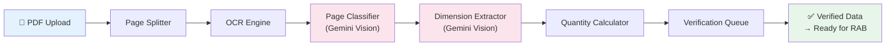
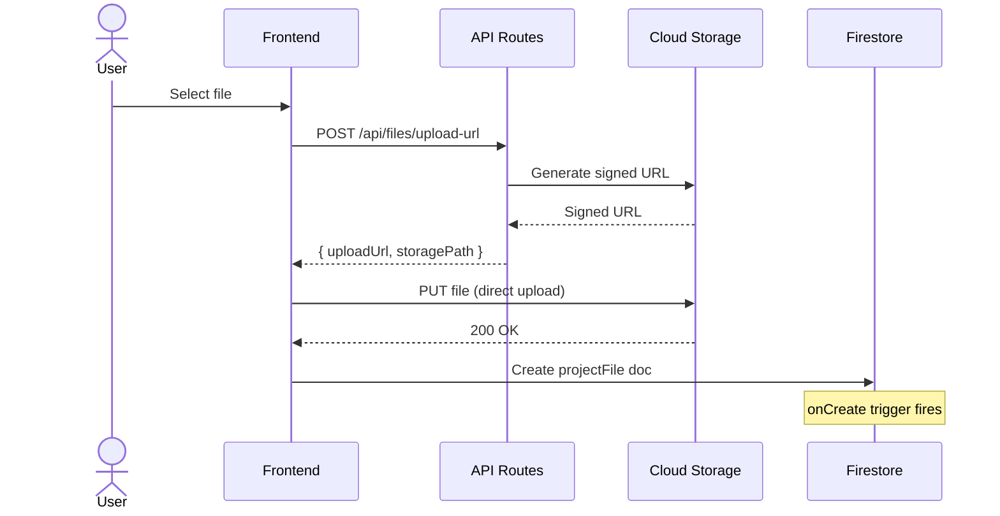

# PAAX AI — Document Intelligence API Documentation

> API reference untuk Document Intelligence service.
> Bertanggung jawab memproses gambar teknik dan dokumen konstruksi.

---

## 1. Overview

Document Intelligence adalah service yang memproses file yang di-upload user
(gambar teknik, spesifikasi, dokumen kontrak) dan mengekstrak informasi yang berguna
untuk RAB dan analisis proyek.

### Processing Pipeline



---

## 2. Pipeline Stages

### Stage 1: Upload & Storage

Ketika user upload file, frontend:
1. Mendapatkan signed URL dari API
2. Upload langsung ke Cloud Storage
3. Membuat record di `projectFiles` collection



### Stage 2: Page Splitting

Untuk file PDF multi-halaman, service memecah menjadi halaman individual:

```python
# services/document-intelligence/src/splitter.py
from pdf2image import convert_from_path

def split_pdf(pdf_path: str, output_dir: str) -> list[PageInfo]:
    """Split PDF into individual page images."""
    images = convert_from_path(pdf_path, dpi=300)
    pages = []
    for i, img in enumerate(images):
        page_path = f"{output_dir}/page_{i+1}.png"
        img.save(page_path, "PNG")
        pages.append(PageInfo(
            page_number=i + 1,
            image_path=page_path,
            width=img.width,
            height=img.height
        ))
    return pages
```

**Output per halaman**:
- High-resolution PNG (300 DPI)
- Thumbnail PNG (150 DPI, max 800px width)
- Page metadata (dimensions, orientation)

### Stage 3: OCR Processing

Mengekstrak teks dari setiap halaman:

```python
# services/document-intelligence/src/ocr.py
import google.cloud.vision as vision

def extract_text(image_path: str) -> OCRResult:
    """Extract text using Google Cloud Vision OCR."""
    client = vision.ImageAnnotatorClient()
    with open(image_path, "rb") as f:
        image = vision.Image(content=f.read())

    response = client.text_detection(image=image)
    texts = response.text_annotations

    return OCRResult(
        full_text=texts[0].description if texts else "",
        blocks=[
            TextBlock(
                text=t.description,
                bounding_box=t.bounding_poly,
                confidence=getattr(t, 'confidence', None)
            )
            for t in texts[1:]
        ]
    )
```

**OCR menangkap**:
- Dimensi (6.00, 4500, 2m x 3m)
- Label ruangan (R. TAMU, KM/WC, DAPUR)
- Notasi teknis (K-300, D16-150, ø12)
- Keterangan (SKALA 1:100, POTONGAN A-A)
- Tabel (jadwal pintu/jendela, finishing)

### Stage 4: Page Classification

Gemini Vision mengklasifikasi setiap halaman:

```python
# services/document-intelligence/src/classifier.py
import google.generativeai as genai

CLASSIFICATION_PROMPT = """
Analisis gambar teknik konstruksi ini dan klasifikasikan ke salah satu kategori:

1. floor_plan (Denah) - Tampak atas/plan view per lantai
2. section (Potongan) - Potongan melintang atau memanjang
3. elevation (Tampak) - Tampak depan/samping/belakang
4. detail (Detail) - Detail konstruksi (tulangan, sambungan, dll)
5. site_plan (Situasi) - Denah lokasi/site plan
6. structural (Struktur) - Gambar struktur (kolom, balok, pondasi)
7. mep (MEP) - Mekanikal, elektrikal, plumbing
8. schedule_table (Tabel) - Tabel spesifikasi (pintu, jendela, finishing)
9. specification (Spesifikasi) - Halaman spesifikasi teknis (teks)
10. unknown (Tidak dikenal) - Tidak dapat diklasifikasi

Berikan juga:
- confidence score (0.0 - 1.0)
- deskripsi singkat isi halaman
- orientasi gambar (portrait/landscape)

Format output sebagai JSON.
"""

async def classify_page(image_path: str) -> ClassificationResult:
    model = genai.GenerativeModel('gemini-2.0-flash')
    image = genai.upload_file(image_path)
    response = await model.generate_content_async([CLASSIFICATION_PROMPT, image])
    return parse_classification(response.text)
```

**Classification Output**:
```json
{
  "classification": "floor_plan",
  "confidence": 0.92,
  "description": "Denah lantai 1 bangunan, menunjukkan layout ruangan dengan dimensi",
  "orientation": "landscape",
  "scale": "1:100",
  "floor": 1
}
```

### Stage 5: Vision Analysis & Dimension Extraction

Gemini Vision mengekstrak dimensi dan informasi detail:

```python
EXTRACTION_PROMPT = """
Dari gambar teknik konstruksi ini (tipe: {classification}), ekstrak semua informasi berikut:

1. DIMENSI:
   - Panjang dan lebar setiap ruangan/area (dalam meter)
   - Tinggi (jika ada di potongan)
   - Dimensi elemen struktur (kolom, balok, dll)

2. MATERIAL:
   - Material yang disebutkan (beton K-xxx, bata ringan, baja, dll)
   - Spesifikasi material (mutu, ukuran, tipe)

3. NOTASI:
   - Skala gambar
   - Elevasi (+0.00, +3.50, dll)
   - Label elemen (K1, B1, S1, dll)

4. QUANTITY HINTS:
   - Jumlah elemen yang terlihat (jumlah kolom, pintu, jendela)
   - Dimensi yang bisa dihitung volume-nya

Format output sebagai JSON terstruktur.
"""
```

**Extraction Output**:
```json
{
  "dimensions": [
    {
      "element": "Ruang Tamu",
      "type": "room",
      "length": 6.0,
      "width": 4.0,
      "area": 24.0,
      "unit": "m",
      "confidence": 0.90
    },
    {
      "element": "Kolom K1",
      "type": "structural",
      "width": 0.4,
      "depth": 0.4,
      "unit": "m",
      "count": 12,
      "confidence": 0.85
    }
  ],
  "materials": [
    { "name": "Beton K-350", "application": "kolom dan balok", "confidence": 0.88 },
    { "name": "Bata Ringan 10cm", "application": "dinding", "confidence": 0.82 }
  ],
  "notations": {
    "scale": "1:100",
    "elevations": ["+0.00", "+3.50", "+7.00"],
    "elementLabels": ["K1", "K2", "B1", "B2", "S1"]
  }
}
```

### Stage 6: Quantity Candidate Generation

Dari data yang diekstrak, sistem menghitung quantity candidates:

```python
# services/document-intelligence/src/quantity_calculator.py

def generate_quantity_candidates(
    extraction: ExtractionResult,
    classification: str
) -> list[QuantityCandidate]:
    """Generate quantity candidates from extracted data."""
    candidates = []

    if classification == "floor_plan":
        # Hitung luas lantai
        total_floor_area = sum(d.area for d in extraction.dimensions if d.type == "room")
        candidates.append(QuantityCandidate(
            item="Pekerjaan Lantai",
            volume=total_floor_area,
            unit="m²",
            source="auto_calculated",
            formula=f"Sum of room areas: {' + '.join(f'{d.element}({d.area})' for d in extraction.dimensions)}",
            confidence=min(d.confidence for d in extraction.dimensions),
            verification_needed=True
        ))

        # Hitung keliling dinding
        total_wall_length = sum((d.length + d.width) * 2 for d in extraction.dimensions if d.type == "room")
        candidates.append(QuantityCandidate(
            item="Pekerjaan Dinding",
            volume=total_wall_length,  # Note: perlu dikali tinggi nanti
            unit="m",  # Linear meter, perlu konversi ke m² dengan tinggi
            source="auto_calculated",
            formula="Sum of room perimeters",
            confidence=0.65,  # Lower karena perlu tinggi dari potongan
            verification_needed=True,
            notes="Perlu dikali tinggi dinding untuk mendapat luas (m²)"
        ))

    elif classification == "structural":
        # Hitung volume kolom
        for d in extraction.dimensions:
            if d.type == "structural" and "kolom" in d.element.lower():
                volume = d.width * d.depth * 3.5 * d.count  # Asumsi tinggi 3.5m
                candidates.append(QuantityCandidate(
                    item=f"Beton Kolom {d.element}",
                    volume=round(volume, 2),
                    unit="m³",
                    source="auto_calculated",
                    formula=f"{d.width}×{d.depth}×3.5m×{d.count} unit",
                    confidence=0.70,
                    verification_needed=True,
                    notes="Tinggi kolom diasumsikan 3.5m, perlu verifikasi dari potongan"
                ))

    return candidates
```

### Stage 7: Verification Queue

Quantity candidates masuk ke verification queue untuk user review:

```json
{
  "fileId": "file_001",
  "pageNumber": 3,
  "status": "pending_verification",
  "candidates": [
    {
      "id": "qc_001",
      "item": "Pekerjaan Lantai Keramik 60x60",
      "volume": 156.5,
      "unit": "m²",
      "confidence": 0.85,
      "formula": "R.Tamu(24) + R.Makan(18) + K.Tidur1(14) + ...",
      "verificationStatus": "auto_approved",
      "verifiedVolume": null,
      "verifiedBy": null,
      "verifiedAt": null
    },
    {
      "id": "qc_002",
      "item": "Pekerjaan Dinding Bata Ringan",
      "volume": 285.0,
      "unit": "m²",
      "confidence": 0.72,
      "formula": "Total wall perimeter × assumed height 3.5m",
      "verificationStatus": "needs_review",
      "verifiedVolume": null,
      "verifiedBy": null,
      "verifiedAt": null
    }
  ]
}
```

---

## 3. API Endpoints

### 3.1 Request Upload URL

```
POST /api/files/upload-url
```

**Request**:
```json
{
  "projectId": "proj_abc123",
  "fileName": "Gambar_Arsitektur.pdf",
  "fileType": "application/pdf",
  "fileSize": 15728640,
  "category": "drawing"
}
```

**Response** `200 OK`:
```json
{
  "uploadUrl": "https://storage.googleapis.com/paax-files/...",
  "storagePath": "projects/proj_abc123/files/abc123_Gambar_Arsitektur.pdf",
  "fileId": "file_abc123",
  "expiresAt": "2026-06-21T10:30:00Z"
}
```

### 3.2 Get Processing Status

```
GET /api/files/{fileId}/status
```

**Response** `200 OK`:
```json
{
  "fileId": "file_abc123",
  "status": "processing",
  "progress": {
    "stage": "classification",
    "currentPage": 5,
    "totalPages": 12,
    "percentComplete": 42
  },
  "startedAt": "2026-06-21T10:05:00Z",
  "estimatedCompletion": "2026-06-21T10:08:00Z"
}
```

### 3.3 Get Extraction Results

```
GET /api/files/{fileId}/extraction
```

**Response** `200 OK`:
```json
{
  "fileId": "file_abc123",
  "fileName": "Gambar_Arsitektur.pdf",
  "status": "processed",
  "pageCount": 12,
  "pages": [
    {
      "pageNumber": 1,
      "classification": "site_plan",
      "confidence": 0.88,
      "thumbnailUrl": "https://storage.googleapis.com/...",
      "extractedData": { "..." : "..." },
      "quantityCandidates": []
    }
  ],
  "summary": {
    "totalCandidates": 24,
    "autoApproved": 15,
    "needsReview": 7,
    "manualRequired": 2
  },
  "processedAt": "2026-06-21T10:08:00Z",
  "processingDuration": 180
}
```

### 3.4 Verify Quantity Candidate

```
PUT /api/files/{fileId}/candidates/{candidateId}/verify
```

**Request**:
```json
{
  "action": "approve",
  "verifiedVolume": 290.0,
  "notes": "Disesuaikan dengan tinggi dinding aktual 3.2m bukan 3.5m"
}
```

**Response** `200 OK`:
```json
{
  "candidateId": "qc_002",
  "verificationStatus": "verified",
  "originalVolume": 285.0,
  "verifiedVolume": 290.0,
  "verifiedBy": "user_abc123",
  "verifiedAt": "2026-06-21T11:00:00Z"
}
```

### 3.5 Reprocess Page

```
POST /api/files/{fileId}/pages/{pageNumber}/reprocess
```

**Description**: Minta AI memproses ulang halaman tertentu (jika hasil sebelumnya kurang baik).

**Request**:
```json
{
  "hints": {
    "classification": "structural",
    "notes": "Ini gambar detail tulangan kolom, bukan denah"
  }
}
```

**Response** `202 Accepted`:
```json
{
  "status": "reprocessing",
  "message": "Halaman 5 akan diproses ulang dengan hint yang diberikan"
}
```

---

## 4. Supported File Types

| Format | Extensions | Max Size | Processing |
|--------|-----------|----------|------------|
| PDF | `.pdf` | 50 MB | Page split → OCR → Vision |
| Image | `.jpg`, `.jpeg`, `.png` | 20 MB | Direct OCR → Vision |
| CAD Export | `.dwg` (converted) | 100 MB | Convert → PDF → Pipeline |
| Document | `.docx`, `.doc` | 20 MB | Text extraction only |

---

## 5. Processing Limits

| Metric | Free Plan | Pro Plan | Enterprise |
|--------|-----------|----------|------------|
| Files per project | 10 | 50 | Unlimited |
| Max file size | 10 MB | 50 MB | 100 MB |
| Pages per file | 20 | 100 | 500 |
| Concurrent processing | 1 | 3 | 10 |
| Monthly processing pages | 100 | 1,000 | 10,000 |

---

## 6. Error Handling

| Error | Cause | Resolution |
|-------|-------|------------|
| `FILE_TOO_LARGE` | File melebihi batas ukuran | Compress atau split file |
| `UNSUPPORTED_FORMAT` | Format file tidak didukung | Convert ke PDF atau JPG |
| `OCR_FAILED` | Gagal membaca teks dari gambar | Pastikan gambar berkualitas baik |
| `CLASSIFICATION_FAILED` | AI tidak bisa mengklasifikasi | Berikan hint manual |
| `EXTRACTION_TIMEOUT` | Processing terlalu lama | Retry atau reprocess per halaman |
| `QUOTA_EXCEEDED` | Melebihi batas processing | Upgrade plan |

---

*Document Intelligence terus di-improve dengan training data dari verifikasi user (feedback loop).*
