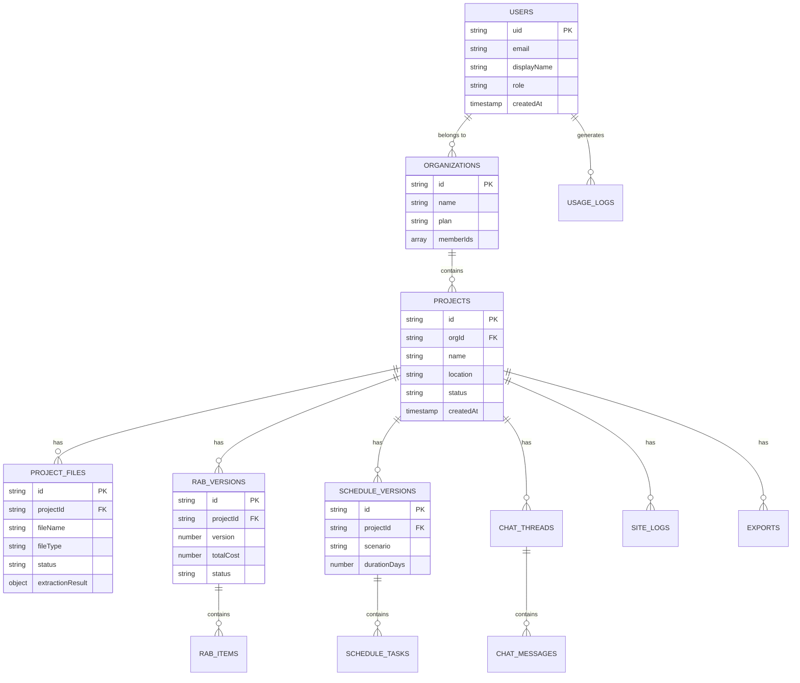

# PAAX AI — Data Model Documentation

> Dokumentasi lengkap Firestore data model untuk PAAX AI v0.3.
> Semua koleksi, field definitions, relationships, dan indexing strategy.

---

## 1. Entity Relationship Diagram



---

## 2. Collection: `users`

**Path**: `/users/{userId}`

Menyimpan profil dan preferensi pengguna.

| Field | Type | Required | Description |
|-------|------|----------|-------------|
| `uid` | `string` | ✅ | Firebase Auth UID (same as document ID) |
| `email` | `string` | ✅ | Email pengguna |
| `displayName` | `string` | ✅ | Nama tampilan |
| `photoURL` | `string` | ❌ | URL foto profil |
| `phone` | `string` | ❌ | Nomor telepon |
| `role` | `string` | ✅ | Global role: `admin`, `user` |
| `organizationIds` | `string[]` | ✅ | Daftar organization ID yang diikuti |
| `preferences` | `object` | ❌ | Preferensi UI (tema, bahasa, dll.) |
| `preferences.language` | `string` | ❌ | `id` atau `en` |
| `preferences.theme` | `string` | ❌ | `light`, `dark`, `system` |
| `preferences.defaultWilayah` | `string` | ❌ | Wilayah harga default |
| `lastLoginAt` | `timestamp` | ✅ | Waktu login terakhir |
| `createdAt` | `timestamp` | ✅ | Waktu registrasi |
| `updatedAt` | `timestamp` | ✅ | Waktu update terakhir |

**Example Document:**

```json
{
  "uid": "user_abc123",
  "email": "budi@konstruksi.co.id",
  "displayName": "Budi Santoso, ST",
  "role": "user",
  "organizationIds": ["org_xyz"],
  "preferences": {
    "language": "id",
    "theme": "light",
    "defaultWilayah": "Kota Bandung 2026"
  },
  "lastLoginAt": "2026-06-21T10:00:00Z",
  "createdAt": "2026-01-15T08:00:00Z",
  "updatedAt": "2026-06-21T10:00:00Z"
}
```

---

## 3. Collection: `organizations`

**Path**: `/organizations/{orgId}`

Menyimpan data organisasi/perusahaan.

| Field | Type | Required | Description |
|-------|------|----------|-------------|
| `id` | `string` | ✅ | Organization ID |
| `name` | `string` | ✅ | Nama organisasi |
| `type` | `string` | ✅ | `contractor`, `consultant`, `owner`, `individual` |
| `plan` | `string` | ✅ | `free`, `pro`, `enterprise` |
| `members` | `object[]` | ✅ | Daftar anggota |
| `members[].userId` | `string` | ✅ | User ID |
| `members[].role` | `string` | ✅ | `owner`, `admin`, `member` |
| `members[].joinedAt` | `timestamp` | ✅ | Waktu bergabung |
| `settings` | `object` | ❌ | Pengaturan organisasi |
| `settings.defaultSNI` | `string` | ❌ | Standar SNI default |
| `settings.logoURL` | `string` | ❌ | URL logo perusahaan |
| `quota` | `object` | ✅ | Batas penggunaan |
| `quota.maxProjects` | `number` | ✅ | Maks proyek aktif |
| `quota.maxStorage` | `number` | ✅ | Maks storage (bytes) |
| `quota.maxAIRequests` | `number` | ✅ | Maks AI request per bulan |
| `createdAt` | `timestamp` | ✅ | Waktu pembuatan |
| `updatedAt` | `timestamp` | ✅ | Waktu update |

---

## 4. Collection: `projects`

**Path**: `/projects/{projectId}`

Koleksi utama yang menjadi pusat semua data proyek.

| Field | Type | Required | Description |
|-------|------|----------|-------------|
| `id` | `string` | ✅ | Project ID |
| `orgId` | `string` | ✅ | Organization ID (FK) |
| `name` | `string` | ✅ | Nama proyek |
| `description` | `string` | ❌ | Deskripsi proyek |
| `type` | `string` | ✅ | Tipe bangunan (enum TipeBangunan) |
| `location` | `object` | ✅ | Lokasi proyek |
| `location.provinsi` | `string` | ✅ | Provinsi |
| `location.kabupaten` | `string` | ✅ | Kabupaten/Kota |
| `location.alamat` | `string` | ❌ | Alamat lengkap |
| `location.koordinat` | `GeoPoint` | ❌ | Koordinat GPS |
| `contract` | `object` | ❌ | Info kontrak |
| `contract.nilaiKontrak` | `number` | ❌ | Nilai kontrak (IDR) |
| `contract.tanggalMulai` | `timestamp` | ❌ | Tanggal mulai |
| `contract.tanggalSelesai` | `timestamp` | ❌ | Tanggal selesai |
| `contract.pemberiKerja` | `string` | ❌ | Nama pemberi kerja |
| `specs` | `object` | ❌ | Spesifikasi bangunan |
| `specs.luasBangunan` | `number` | ❌ | Luas bangunan (m²) |
| `specs.jumlahLantai` | `number` | ❌ | Jumlah lantai |
| `specs.luasLahan` | `number` | ❌ | Luas lahan (m²) |
| `settings` | `object` | ✅ | Pengaturan proyek |
| `settings.sniVersion` | `string` | ✅ | Versi SNI yang digunakan |
| `settings.wilayahHarga` | `string` | ✅ | Wilayah harga satuan |
| `settings.matauang` | `string` | ✅ | Mata uang (default: IDR) |
| `settings.ppnRate` | `number` | ✅ | Tarif PPN (default: 0.11) |
| `settings.overheadRate` | `number` | ❌ | Tarif overhead & profit |
| `status` | `string` | ✅ | `draft`, `active`, `completed`, `archived` |
| `summary` | `object` | ❌ | Ringkasan terkini (computed) |
| `summary.totalRAB` | `number` | ❌ | Total RAB terbaru |
| `summary.rabVersion` | `number` | ❌ | Versi RAB terbaru |
| `summary.fileCount` | `number` | ❌ | Jumlah file |
| `summary.progressPercent` | `number` | ❌ | Progress lapangan (%) |
| `createdBy` | `string` | ✅ | User ID pembuat |
| `createdAt` | `timestamp` | ✅ | Waktu pembuatan |
| `updatedAt` | `timestamp` | ✅ | Waktu update terakhir |

---

## 5. Collection: `projectFiles`

**Path**: `/projectFiles/{fileId}`

Menyimpan metadata file yang di-upload ke proyek.

| Field | Type | Required | Description |
|-------|------|----------|-------------|
| `id` | `string` | ✅ | File ID |
| `projectId` | `string` | ✅ | Project ID (FK) |
| `fileName` | `string` | ✅ | Nama file asli |
| `fileType` | `string` | ✅ | MIME type |
| `fileSize` | `number` | ✅ | Ukuran file (bytes) |
| `storagePath` | `string` | ✅ | Path di Cloud Storage |
| `category` | `string` | ✅ | `drawing`, `specification`, `contract`, `photo`, `other` |
| `status` | `string` | ✅ | `uploading`, `uploaded`, `processing`, `processed`, `error` |
| `processingResult` | `object` | ❌ | Hasil processing AI |
| `processingResult.pageCount` | `number` | ❌ | Jumlah halaman |
| `processingResult.pages` | `object[]` | ❌ | Hasil per halaman |
| `processingResult.pages[].pageNumber` | `number` | ❌ | Nomor halaman |
| `processingResult.pages[].classification` | `string` | ❌ | Klasifikasi halaman |
| `processingResult.pages[].confidence` | `number` | ❌ | Confidence score |
| `processingResult.pages[].extractedData` | `object` | ❌ | Data yang diekstrak |
| `processingResult.pages[].thumbnailPath` | `string` | ❌ | Path thumbnail |
| `processingError` | `string` | ❌ | Error message jika gagal |
| `uploadedBy` | `string` | ✅ | User ID yang upload |
| `createdAt` | `timestamp` | ✅ | Waktu upload |
| `updatedAt` | `timestamp` | ✅ | Waktu update |

---

## 6. Collection: `rabVersions`

**Path**: `/rabVersions/{rabId}`

Menyimpan versi RAB proyek. Setiap generate/recalculate membuat versi baru.

| Field | Type | Required | Description |
|-------|------|----------|-------------|
| `id` | `string` | ✅ | RAB version ID |
| `projectId` | `string` | ✅ | Project ID (FK) |
| `version` | `number` | ✅ | Nomor versi (1, 2, 3...) |
| `status` | `string` | ✅ | `generating`, `draft`, `reviewed`, `approved`, `locked` |
| `metadata` | `object` | ✅ | Metadata perhitungan |
| `metadata.sniVersion` | `string` | ✅ | SNI yang digunakan |
| `metadata.wilayahHarga` | `string` | ✅ | Wilayah harga |
| `metadata.calculatedAt` | `timestamp` | ✅ | Waktu kalkulasi |
| `metadata.calculationEngine` | `string` | ✅ | Versi engine |
| `divisions` | `object[]` | ✅ | Divisi pekerjaan |
| `divisions[].code` | `string` | ✅ | Kode divisi (e.g., "01") |
| `divisions[].name` | `string` | ✅ | Nama divisi |
| `divisions[].subtotal` | `number` | ✅ | Subtotal divisi |
| `divisions[].items` | `object[]` | ✅ | Item pekerjaan |
| `divisions[].items[].code` | `string` | ✅ | Kode item |
| `divisions[].items[].name` | `string` | ✅ | Nama item pekerjaan |
| `divisions[].items[].volume` | `number` | ✅ | Volume |
| `divisions[].items[].unit` | `string` | ✅ | Satuan (m², m³, kg, dll.) |
| `divisions[].items[].hsp` | `number` | ✅ | Harga Satuan Pekerjaan |
| `divisions[].items[].total` | `number` | ✅ | Volume × HSP |
| `divisions[].items[].ahspId` | `string` | ❌ | Reference ke AHSP |
| `divisions[].items[].source` | `string` | ✅ | `ai_extracted`, `manual`, `imported` |
| `summary` | `object` | ✅ | Ringkasan RAB |
| `summary.subtotal` | `number` | ✅ | Total sebelum PPN |
| `summary.ppn` | `number` | ✅ | Nilai PPN |
| `summary.overhead` | `number` | ❌ | Overhead & profit |
| `summary.grandTotal` | `number` | ✅ | Grand total |
| `summary.itemCount` | `number` | ✅ | Jumlah item |
| `summary.divisionCount` | `number` | ✅ | Jumlah divisi |
| `aiReview` | `object` | ❌ | Hasil review AI |
| `aiReview.insights` | `string[]` | ❌ | AI insights |
| `aiReview.riskItems` | `string[]` | ❌ | Item berisiko |
| `aiReview.optimizations` | `string[]` | ❌ | Saran optimasi |
| `aiReview.benchmarkComparison` | `object` | ❌ | Perbandingan benchmark |
| `createdBy` | `string` | ✅ | User ID pembuat |
| `createdAt` | `timestamp` | ✅ | Waktu pembuatan |
| `updatedAt` | `timestamp` | ✅ | Waktu update |

---

## 7. Collection: `scheduleVersions`

**Path**: `/scheduleVersions/{scheduleId}`

Menyimpan versi jadwal pelaksanaan proyek.

| Field | Type | Required | Description |
|-------|------|----------|-------------|
| `id` | `string` | ✅ | Schedule version ID |
| `projectId` | `string` | ✅ | Project ID (FK) |
| `version` | `number` | ✅ | Nomor versi |
| `scenario` | `string` | ✅ | `normal`, `accelerated`, `delay_recovery`, `custom` |
| `status` | `string` | ✅ | `generating`, `draft`, `approved` |
| `startDate` | `timestamp` | ✅ | Tanggal mulai proyek |
| `endDate` | `timestamp` | ✅ | Tanggal selesai proyek |
| `durationDays` | `number` | ✅ | Durasi total (hari kerja) |
| `tasks` | `object[]` | ✅ | Daftar pekerjaan |
| `tasks[].id` | `string` | ✅ | Task ID |
| `tasks[].name` | `string` | ✅ | Nama pekerjaan |
| `tasks[].rabItemCode` | `string` | ❌ | Kode item RAB terkait |
| `tasks[].startDate` | `timestamp` | ✅ | Tanggal mulai |
| `tasks[].endDate` | `timestamp` | ✅ | Tanggal selesai |
| `tasks[].duration` | `number` | ✅ | Durasi (hari kerja) |
| `tasks[].dependencies` | `string[]` | ❌ | Task ID dependencies |
| `tasks[].progress` | `number` | ❌ | Progress (0-100%) |
| `tasks[].resources` | `object[]` | ❌ | Sumber daya yang dibutuhkan |
| `criticalPath` | `string[]` | ✅ | Task IDs pada critical path |
| `totalFloat` | `number` | ✅ | Total float (hari) |
| `rabVersionId` | `string` | ✅ | RAB version yang digunakan |
| `createdBy` | `string` | ✅ | User ID pembuat |
| `createdAt` | `timestamp` | ✅ | Waktu pembuatan |
| `updatedAt` | `timestamp` | ✅ | Waktu update |

---

## 8. Collection: `chatThreads`

**Path**: `/chatThreads/{threadId}`

Menyimpan thread percakapan dengan AI.

| Field | Type | Required | Description |
|-------|------|----------|-------------|
| `id` | `string` | ✅ | Thread ID |
| `projectId` | `string` | ✅ | Project ID (FK) |
| `userId` | `string` | ✅ | User ID yang memulai |
| `title` | `string` | ✅ | Judul thread (auto-generated) |
| `type` | `string` | ✅ | `engineering_chat`, `rab_advisor`, `schedule_advisor` |
| `status` | `string` | ✅ | `active`, `archived` |
| `messageCount` | `number` | ✅ | Jumlah pesan |
| `context` | `object` | ❌ | Konteks yang di-attach |
| `context.rabVersionId` | `string` | ❌ | RAB version yang dibahas |
| `context.fileIds` | `string[]` | ❌ | File yang di-reference |
| `context.scheduleId` | `string` | ❌ | Schedule yang dibahas |
| `lastMessageAt` | `timestamp` | ✅ | Waktu pesan terakhir |
| `createdAt` | `timestamp` | ✅ | Waktu pembuatan |

### Subcollection: `chatThreads/{threadId}/messages`

| Field | Type | Required | Description |
|-------|------|----------|-------------|
| `id` | `string` | ✅ | Message ID |
| `role` | `string` | ✅ | `user`, `assistant`, `system`, `tool` |
| `content` | `string` | ✅ | Isi pesan |
| `toolCalls` | `object[]` | ❌ | Tool yang dipanggil AI |
| `toolCalls[].name` | `string` | ❌ | Nama tool |
| `toolCalls[].input` | `object` | ❌ | Input parameter |
| `toolCalls[].output` | `object` | ❌ | Output result |
| `metadata` | `object` | ❌ | Metadata pesan |
| `metadata.model` | `string` | ❌ | Model AI yang digunakan |
| `metadata.tokensUsed` | `number` | ❌ | Jumlah token |
| `metadata.latencyMs` | `number` | ❌ | Latency response |
| `createdAt` | `timestamp` | ✅ | Waktu kirim |

---

## 9. Collection: `siteLogs`

**Path**: `/siteLogs/{logId}`

Menyimpan laporan harian lapangan.

| Field | Type | Required | Description |
|-------|------|----------|-------------|
| `id` | `string` | ✅ | Log ID |
| `projectId` | `string` | ✅ | Project ID (FK) |
| `date` | `timestamp` | ✅ | Tanggal laporan |
| `weather` | `object` | ❌ | Kondisi cuaca |
| `weather.condition` | `string` | ❌ | `cerah`, `mendung`, `hujan_ringan`, `hujan_deras` |
| `weather.temperature` | `number` | ❌ | Suhu (°C) |
| `workers` | `object` | ❌ | Data pekerja |
| `workers.mandor` | `number` | ❌ | Jumlah mandor |
| `workers.tukang` | `number` | ❌ | Jumlah tukang |
| `workers.pekerja` | `number` | ❌ | Jumlah pekerja kasar |
| `activities` | `object[]` | ❌ | Aktivitas hari ini |
| `activities[].description` | `string` | ❌ | Deskripsi pekerjaan |
| `activities[].rabItemCode` | `string` | ❌ | Item RAB terkait |
| `activities[].progressPercent` | `number` | ❌ | Progress hari ini |
| `photos` | `object[]` | ❌ | Foto lapangan |
| `photos[].storagePath` | `string` | ❌ | Path di Cloud Storage |
| `photos[].caption` | `string` | ❌ | Keterangan foto |
| `photos[].aiAnalysis` | `string` | ❌ | Hasil analisis AI |
| `issues` | `object[]` | ❌ | Masalah/kendala |
| `issues[].description` | `string` | ❌ | Deskripsi masalah |
| `issues[].severity` | `string` | ❌ | `low`, `medium`, `high`, `critical` |
| `issues[].status` | `string` | ❌ | `open`, `in_progress`, `resolved` |
| `notes` | `string` | ❌ | Catatan tambahan |
| `aiSummary` | `string` | ❌ | Ringkasan AI otomatis |
| `reportedBy` | `string` | ✅ | User ID pelapor |
| `createdAt` | `timestamp` | ✅ | Waktu pembuatan |
| `updatedAt` | `timestamp` | ✅ | Waktu update |

---

## 10. Collection: `exports`

**Path**: `/exports/{exportId}`

Menyimpan record file yang di-export.

| Field | Type | Required | Description |
|-------|------|----------|-------------|
| `id` | `string` | ✅ | Export ID |
| `projectId` | `string` | ✅ | Project ID (FK) |
| `type` | `string` | ✅ | `rab_excel`, `schedule_excel`, `report_pdf`, `bundle_zip` |
| `sourceId` | `string` | ✅ | ID sumber (RAB version, schedule version, dll.) |
| `fileName` | `string` | ✅ | Nama file output |
| `storagePath` | `string` | ✅ | Path di Cloud Storage |
| `fileSize` | `number` | ✅ | Ukuran file (bytes) |
| `status` | `string` | ✅ | `generating`, `ready`, `expired`, `error` |
| `downloadURL` | `string` | ❌ | Signed URL (sementara) |
| `expiresAt` | `timestamp` | ❌ | Waktu expired signed URL |
| `generatedBy` | `string` | ✅ | User ID |
| `createdAt` | `timestamp` | ✅ | Waktu generate |

---

## 11. Collection: `usageLogs`

**Path**: `/usageLogs/{logId}`

Audit trail untuk semua aktivitas penting.

| Field | Type | Required | Description |
|-------|------|----------|-------------|
| `id` | `string` | ✅ | Log ID |
| `userId` | `string` | ✅ | User ID pelaku |
| `orgId` | `string` | ✅ | Organization ID |
| `projectId` | `string` | ❌ | Project ID (jika terkait proyek) |
| `action` | `string` | ✅ | Kode aksi (lihat tabel di bawah) |
| `resource` | `string` | ✅ | Resource yang terpengaruh |
| `resourceId` | `string` | ✅ | ID resource |
| `details` | `object` | ❌ | Detail tambahan |
| `details.before` | `object` | ❌ | State sebelum (untuk update) |
| `details.after` | `object` | ❌ | State sesudah (untuk update) |
| `details.tokensUsed` | `number` | ❌ | Token AI yang digunakan |
| `details.computeTimeMs` | `number` | ❌ | Waktu compute |
| `ipAddress` | `string` | ❌ | IP address user |
| `userAgent` | `string` | ❌ | Browser user agent |
| `createdAt` | `timestamp` | ✅ | Waktu aksi |

### Action Codes

| Action Code | Description |
|-------------|-------------|
| `project.create` | Buat proyek baru |
| `project.update` | Update proyek |
| `project.delete` | Hapus proyek |
| `file.upload` | Upload file |
| `file.process` | AI memproses file |
| `rab.generate` | Generate RAB |
| `rab.recalculate` | Recalculate RAB |
| `rab.approve` | Approve RAB |
| `schedule.generate` | Generate jadwal |
| `chat.message` | Kirim pesan chat |
| `export.generate` | Generate export |
| `export.download` | Download export |
| `site.report` | Submit daily report |
| `member.add` | Tambah anggota tim |
| `member.remove` | Hapus anggota tim |

---

## 12. Firestore Indexes

### Composite Indexes Required

```
Collection: projects
  - orgId ASC, createdAt DESC
  - orgId ASC, status ASC, createdAt DESC

Collection: projectFiles
  - projectId ASC, createdAt DESC
  - projectId ASC, status ASC

Collection: rabVersions
  - projectId ASC, version DESC

Collection: scheduleVersions
  - projectId ASC, version DESC

Collection: chatThreads
  - projectId ASC, lastMessageAt DESC
  - userId ASC, lastMessageAt DESC

Collection: siteLogs
  - projectId ASC, date DESC

Collection: exports
  - projectId ASC, createdAt DESC

Collection: usageLogs
  - orgId ASC, createdAt DESC
  - userId ASC, action ASC, createdAt DESC
  - projectId ASC, action ASC, createdAt DESC
```

---

## 13. Security Rules Sketch

```javascript
// firestore.rules
rules_version = '2';
service cloud.firestore {
  match /databases/{database}/documents {

    // Users can only read/write their own profile
    match /users/{userId} {
      allow read, write: if request.auth.uid == userId;
    }

    // Organization members can read org data
    match /organizations/{orgId} {
      allow read: if request.auth.uid in resource.data.members.map(m => m.userId);
      allow write: if isOrgAdmin(orgId);
    }

    // Project access scoped to organization
    match /projects/{projectId} {
      allow read: if isProjectMember(projectId);
      allow create: if isOrgMember(request.resource.data.orgId);
      allow update, delete: if isProjectEditor(projectId);
    }

    // All project-related collections follow project access
    match /projectFiles/{fileId} {
      allow read: if isProjectMember(resource.data.projectId);
      allow write: if isProjectEditor(resource.data.projectId);
    }

    // Similar rules for rabVersions, scheduleVersions, etc.
  }
}
```

---

*Data model ini akan berkembang seiring penambahan fitur. Setiap perubahan harus melalui review dan migrasi yang terdokumentasi.*
