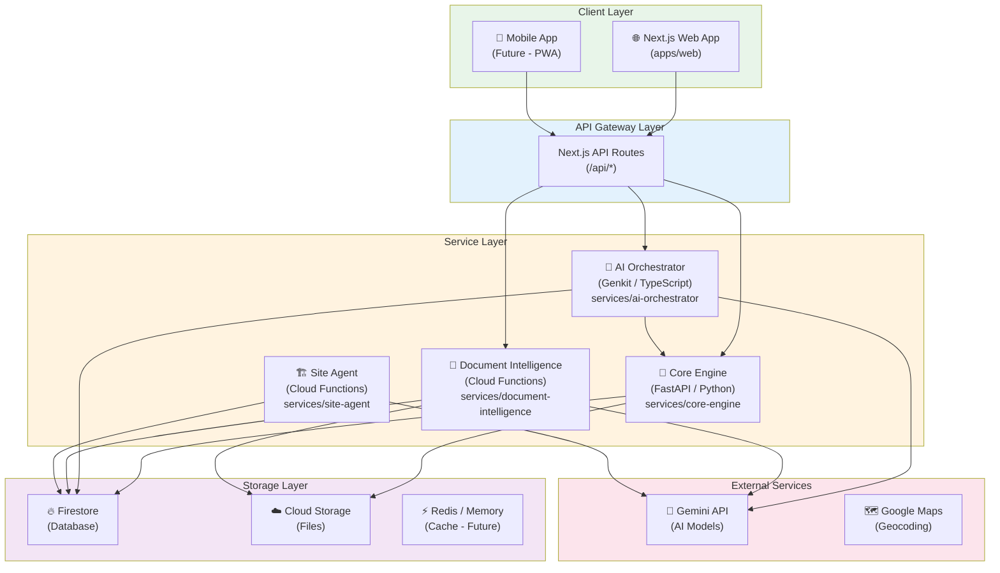
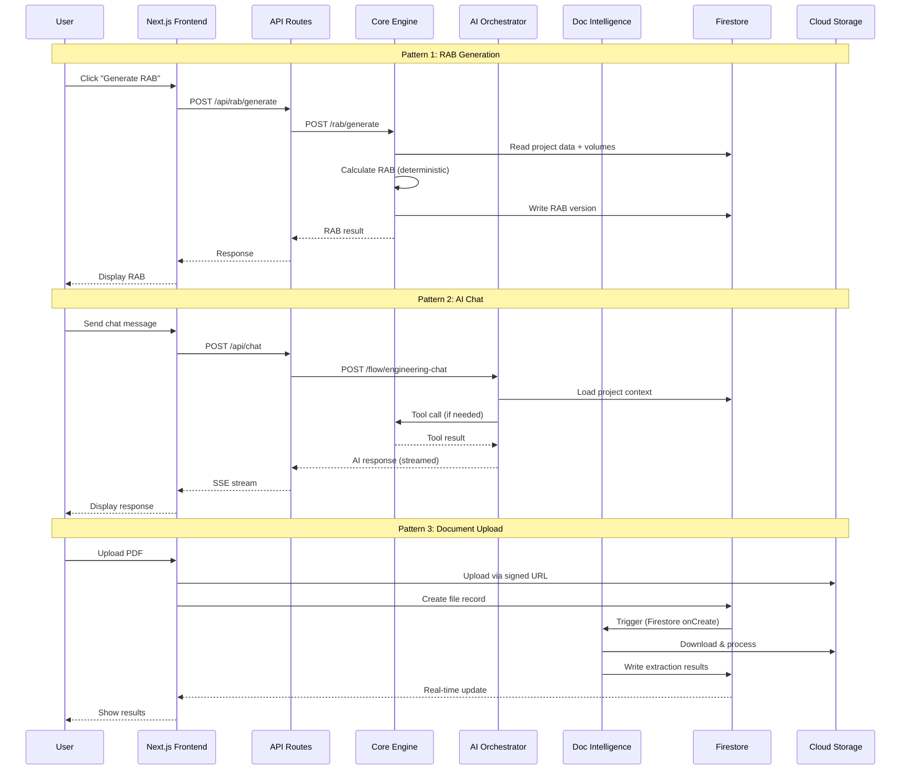
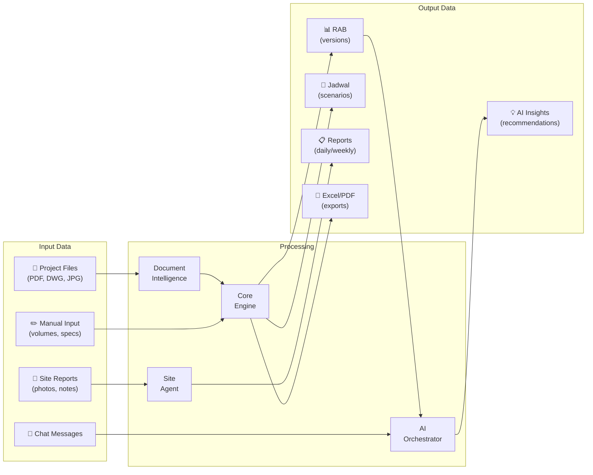
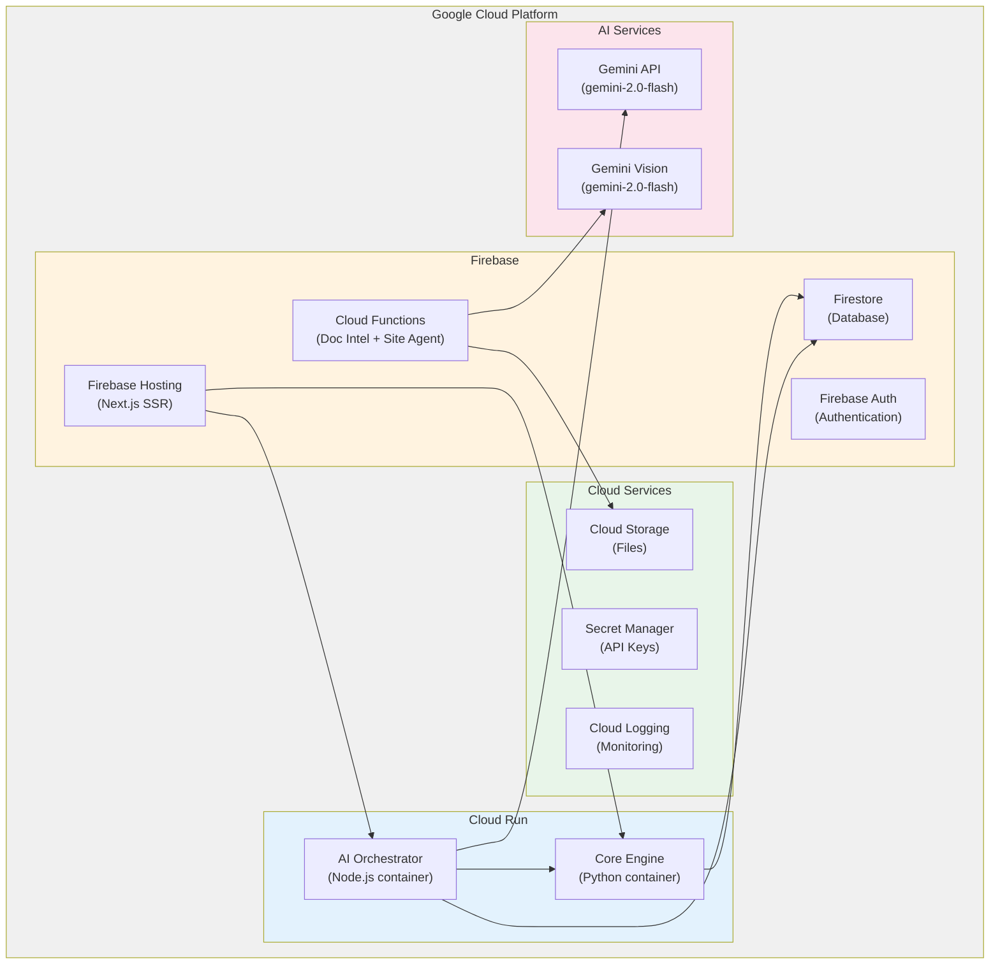
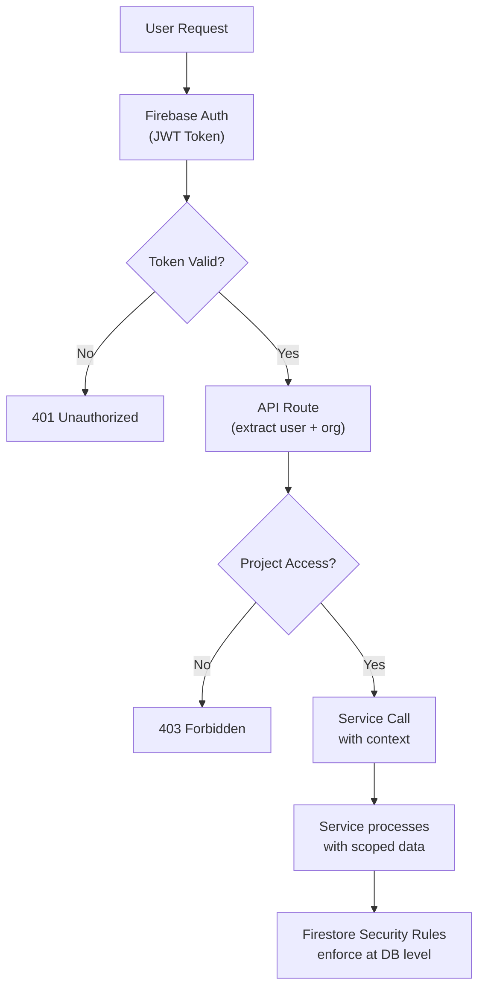

# PAAX AI — System Architecture Overview

> Arsitektur sistem PAAX AI v0.3: layered architecture dengan pemisahan jelas
> antara frontend, API layer, services, dan storage.

---

## 1. High-Level Architecture



---

## 2. Service Boundaries

Setiap service memiliki tanggung jawab yang jelas dan tidak overlap:

### 2.1 Frontend (Next.js) — `apps/web/`

**Responsibility**: Display, interaction, routing

```
✅ DOES:
- Render UI components
- Handle user interactions
- Client-side routing (/project/:id/*)
- Form validation (client-side)
- Real-time Firestore subscriptions (read-only)
- File upload to Cloud Storage (via signed URLs)
- Call API routes for mutations

❌ DOES NOT:
- Direct database writes (except real-time reads)
- Business logic calculations
- AI model calls
- File processing
```

### 2.2 Core Engine (FastAPI) — `services/core-engine/`

**Responsibility**: Deterministic calculation, data processing, export

```
✅ DOES:
- RAB calculation (volume × HSP)
- AHSP lookup and computation
- Schedule generation (CPM algorithm)
- Excel export (template-based)
- Data validation (server-side)
- Harga satuan management

❌ DOES NOT:
- AI/LLM calls
- File upload handling
- User authentication
- Frontend rendering
```

### 2.3 AI Orchestrator (Genkit) — `services/ai-orchestrator/`

**Responsibility**: AI flow management, tool calling, chat

```
✅ DOES:
- Engineering chat with context
- RAB advisory analysis
- Schedule advisory
- Drawing understanding coordination
- Tool calling to Core Engine
- Prompt management
- Context assembly from project data

❌ DOES NOT:
- Direct calculation (delegates to Core Engine)
- File processing (delegates to Document Intelligence)
- Database schema management
- User authentication
```

### 2.4 Document Intelligence — `services/document-intelligence/`

**Responsibility**: File processing, OCR, extraction

```
✅ DOES:
- PDF page splitting
- OCR processing
- Page classification (via Gemini Vision)
- Dimension extraction
- Quantity candidate generation
- File format conversion

❌ DOES NOT:
- RAB calculation
- User-facing chat
- Schedule generation
- Direct user interaction
```

### 2.5 Site Agent — `services/site-agent/`

**Responsibility**: Field monitoring, reporting

```
✅ DOES:
- Daily report analysis
- Progress vs plan comparison
- Photo analysis (Gemini Vision)
- Anomaly detection
- Auto-generated reports
- Weather impact assessment

❌ DOES NOT:
- RAB modification
- File upload processing
- Schedule recalculation (requests Core Engine)
```

---

## 3. Communication Patterns



---

## 4. Data Flow Architecture



---

## 5. Deployment Architecture



---

## 6. Technology Stack

### 6.1 Frontend

| Component | Technology | Version | Purpose |
|-----------|-----------|---------|---------|
| Framework | Next.js | 15.x | SSR + routing |
| Language | TypeScript | 5.x | Type safety |
| UI Library | shadcn/ui | latest | Component library |
| Styling | Tailwind CSS | 4.x | Utility-first CSS |
| State | Zustand | 5.x | Client state management |
| Charts | Recharts | 2.x | Data visualization |
| Gantt | Custom | — | Schedule visualization |

### 6.2 Core Engine

| Component | Technology | Version | Purpose |
|-----------|-----------|---------|---------|
| Framework | FastAPI | 0.115+ | REST API |
| Language | Python | 3.12+ | Calculation logic |
| Validation | Pydantic | 2.x | Schema validation |
| Excel | openpyxl | 3.x | Excel generation |
| Database | firebase-admin | 6.x | Firestore access |
| Testing | pytest | 8.x | Unit/integration tests |

### 6.3 AI Orchestrator

| Component | Technology | Version | Purpose |
|-----------|-----------|---------|---------|
| Framework | Genkit | 1.x | AI flow framework |
| Language | TypeScript | 5.x | Type-safe flows |
| AI Model | Gemini 2.0 Flash | latest | LLM inference |
| Runtime | Node.js | 22.x | Server runtime |

### 6.4 Shared Packages

| Package | Path | Purpose |
|---------|------|---------|
| `@paax/types` | `packages/types/` | Shared TypeScript type definitions |
| `@paax/schemas` | `packages/schemas/` | Zod validation schemas |
| `@paax/utils` | `packages/utils/` | Common utility functions |
| `@paax/config` | `packages/config/` | Shared configuration |
| `@paax/ui` | `packages/ui/` | Shared UI components |

---

## 7. Security Architecture



### Key Security Principles:

1. **Authentication**: Firebase Auth (email/password + Google OAuth)
2. **Authorization**: Project-level RBAC (Owner, Editor, Viewer)
3. **Data Isolation**: Firestore security rules scope queries to organization
4. **File Access**: Signed URLs with expiration for Cloud Storage
5. **Secret Management**: Google Secret Manager for API keys
6. **AI Safety**: Prompt injection mitigation in AI Orchestrator
7. **Audit Trail**: All mutations logged in `usageLogs` collection

---

## 8. Scalability Considerations

| Aspect | Current (MVP) | Future Scale |
|--------|---------------|--------------|
| Users | ~100 | 10,000+ |
| Projects | ~500 | 50,000+ |
| File Storage | 100 GB | 10 TB+ |
| AI Requests | 1,000/day | 100,000/day |
| Compute | Cloud Run (min instances: 0) | Cloud Run (auto-scale) |
| Database | Firestore (free tier) | Firestore (paid tier + indexes) |
| Caching | None | Redis / Memorystore |

---

*Arsitektur ini dirancang untuk skala MVP dan bisa di-scale secara horizontal menggunakan Google Cloud infrastructure.*
