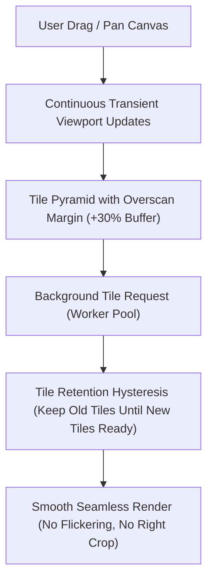

# PAAX Drawing Intelligence — Remediation Plan: Sheet Review Canvas Flickering & Right-Crop Fix

**Dokumen Rencana Perbaikan Arsitektur UI/UX Canvas & Navigation**  
**Repository**: `G:\paax-ai-contextual-integration`  
**Target Sub-sistem**: `apps/web/src/components/drawing-intelligence/workspace/`  
**Status**: `PROPOSED PLAN (WAITING APPROVAL)`  

---

## 1. Ringkasan Eksplorasi & Analisis Root Cause

Berdasarkan analisis mendalam pada kode `apps/web/src/components/drawing-intelligence/workspace/` (khususnya `drawing-canvas.tsx`, `pdf-page-layer.tsx`, `pdf-tile-pyramid.ts`, dan `file-sheet-navigator.tsx`):

### Root Cause 1: Viewport Beku Saat Drag/Pan Canvas (`drawing-canvas.tsx`)
- **Gejala**: Bagian kanan gambar hilang terpotong saat digeser ke kiri, dan berkedip saat drag dilepas.
- **Akar Masalah**:
  Saat pengguna menggeser kanvas dengan mouse/pointer (`onPointerMove`), `drawing-canvas.tsx` memperbarui `style.transform` pada DOM element (`pageTransformRef`) secara langsung via `requestAnimationFrame` demi performa. Namun, **nilai React state `panX` dan `panY` TIDAK diperbarui** selama proses dragging berjalan, dan baru di-commit ke React state pada saat `onPointerUp`.
- **Dampak**:
  Objek `viewport` yang dikirimkan ke `<PdfPageLayer>` dihitung berdasarkan `panX` dan `panY` dari React state. Karena state beku selama drag, `<PdfPageLayer>` tetap mengira viewport berada di lokasi lama sebelum di-drag. Ketika area kanan gambar digeser masuk ke layar, `pdf-tile-pyramid` tidak meminta tile baru untuk area kanan tersebut karena dianggap di luar viewport. Akibatnya, **sisi kanan kanvas menjadi kosong/terpotong (blank)**. Begitu mouse dilepas (`onPointerUp`), state `panX` baru ter-update, viewport meloncat mendadak, dan tile kanan di-fetch serentak memicu **flicker/kedipan visual**.

---

### Root Cause 2: Pemusnahan Tile DOM Instan Tanpa Double-Buffering (`pdf-page-layer.tsx`)
- **Gejala**: Kanvas berkedip-kedip (flashing putih/transparan) dan pergerakan gambar tidak mulus saat digerakkan ke kiri dan kanan.
- **Akar Masalah**:
  Di `pdf-page-layer.tsx`, fungsi `setPainted` langsung menghapus tile dari `painted` Map jika tile tersebut tidak ada dalam daftar `desiredKeys` untuk viewport saat itu:
  ```tsx
  setPainted((prev) => {
    let changed = false;
    const next = new Map(prev);
    for (const key of prev.keys()) {
      if (!desiredKeys.has(key)) {
        next.delete(key); // DOM element langsung di-unmount!
        changed = true;
      }
    }
    return changed ? next : prev;
  });
  ```
- **Dampak**:
  DOM canvas tile dihancurkan secara instan *sebelum* tile pengganti di lokasi/zoom baru selesai diproses oleh Web Worker dan terlukis. Hal ini menimbulkan celah tanpa gambar (flashing) setiap kali viewport bergeser.

---

### Root Cause 3: Aspect Ratio Refit Ganda Saat Transisi Sheet Gallery -> Review (`drawing-canvas.tsx`)
- **Gejala**: Saat mengklik gambar di sheet utama (gallery) untuk di-review, kanvas berkedip dan meloncat ukurannya.
- **Akar Masalah**:
  Saat `activeSheetId` berganti, `setPdfMetrics(null)` dijalankan. `fitSheet()` pertama kali dipanggil menggunakan aspek rasio estimasi fallback. Begitu PDF binary selesai dibaca oleh worker dan mengembalikan `onMetrics({ width, height })`, `setPdfMetrics` memicu `useEffect` kedua yang menjalankan `fitSheet()` **untuk kedua kalinya** dengan aspek rasio asli PDF.
- **Dampak**:
  Layout dan zoom kanvas dihitung 2x secara berurutan dalam waktu singkat, menimbulkan lompatan visual (*layout jump*) pada kanvas.

---

### Root Cause 4: Sub-Pixel Seam & Celah Persentase CSS (`pdf-page-layer.tsx`)
- **Gejala**: Garis tipis terpotong atau celah transparan tampak di batas pinggir kanan tile canvas pada layar High-DPR (Retina/4K).
- **Akar Masalah**:
  Perhitungan posisi persentase CSS tile (`left: ${(tile.x / density / pageWidth) * 100}%`) mengalami pembulatan sub-pixel di browser engine.

---

## 2. Rencana Perbaikan Eksekusi (Solusi Arsitektur)



### Komponen 1: Continuous Viewport & Overscan Padding (`drawing-canvas.tsx` & `pdf-tile-pyramid.ts`)
1. **Overscan Viewport Margin (+30%)**:
   Tambahkan margin overscan (padding sebesar 30% dari lebar & tinggi viewport) pada kalkulasi `visibleTiles` di `pdf-tile-pyramid.ts` atau `drawing-canvas.tsx`. Dengan overscan ini, tile di sebelah kanan, kiri, atas, dan bawah layar akan di-fetch dan di-render *sebelum* pengguna menggeser kanvas ke sana.
2. **Live Transient Viewport Sync**:
   Perbarui objek `viewport` selama dragging menggunakan posisi transient mouse (`pendingPanRef.current`) sehingga `<PdfPageLayer>` tetap menyadari pergerakan posisi kanvas secara real-time tanpa memicu *heavy re-render* pada komponen React utama.

### Komponen 2: Tile Retention Hysteresis / Smooth Swap (`pdf-page-layer.tsx`)
1. **Graceful Tile Hysteresis**:
   Ubah logika `setPainted` agar tile yang sudah terlukis di DOM **TIDAK langsung di-unmount** ketika keluar dari `desiredKeys`.
2. **Double-Buffered Tile Swap**:
   Pertahankan tile lama dengan opacity/z-index di bawahnya sampai tile baru selesai diklaim (`delivery.claim()`) dan digambar pada canvas baru. Setelah tile baru siap, tile lama baru dibersihkan dengan aman dari DOM.

### Komponen 3: Unified Aspect & Single Refit (`drawing-canvas.tsx`)
1. **Single-Pass Refit**:
   Gunakan metadata aspek rasio yang tersedia dari `mappedSheet` atau `sheet` terlebih dahulu, dan cegah rekalkulasi `fitSheet()` berulang jika aspek rasio PDF yang dikembalikan `onMetrics` presisi sama dengan aspek rasio sheet.

### Komponen 4: Sub-Pixel Seam Bleed (+0.5px Overlap) (`pdf-page-layer.tsx`)
1. **CSS Tile Overlap**:
   Tambahkan mikro-bleed (+0.5px atau `calc(100% + 0.5px)`) pada width dan height `TileCanvas` untuk menghilangkan garis potong sub-pixel di ujung kanan tile.

---

## 3. Rencana Verifikasi & Testing

### 1. Automated Vitest Unit Tests
- `apps/web/src/components/drawing-intelligence/workspace/canvas/pdf-page-layer.test.tsx`:
  - Verifikasi bahwa tile lama tetap ditahan (retained) di DOM selama tile baru dalam proses fetching.
  - Verifikasi bahwa overscan viewport mencakup tile di luar batas layar (+30% margin).
- `apps/web/src/components/drawing-intelligence/workspace/canvas/pdf-tile-pyramid.test.ts`:
  - Verifikasi perhitungan `visibleTiles` dengan overscan viewport margin untuk pergerakan kanan/kiri.

### 2. Manual Visual Verification Checklist
1. Buka workspace Drawing Intelligence pada `http://127.0.0.1:3000/drawing-intelligence`.
2. Dari mode **Sheets** (Gallery Utama), klik salah satu sheet untuk berpindah ke mode **Review**.
3. Pastikan transisi kanvas berlangsung mulus tanpa lompatan aspek rasio (*no double refit jump*).
4. Lakukan drag/pan ke kanan dan ke kiri secara cepat menggunakan mouse middle-click atau Tool Pan.
5. Pastikan **sisi kanan kanvas TIDAK terpotong/blank**, gambar di render utuh sampai ke pinggir kanan, dan tidak ada kedipan putih/flashing saat digerakkan.

---

## 4. Lokasi File Rencana Ini
- File rencana tersimpan di: [REMEDIATION_PLAN_SHEET_REVIEW_CANVAS_FLICKER_AND_RIGHT_CROP.md](file:///g:/paax-ai-contextual-integration/docs/plans/REMEDIATION_PLAN_SHEET_REVIEW_CANVAS_FLICKER_AND_RIGHT_CROP.md)
