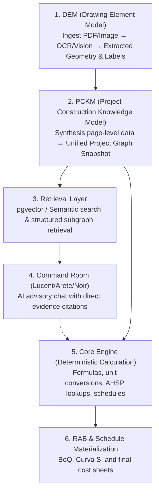

# 🎯 PAAX AI — Drawing Intelligence Source of Truth

> Dokumen koordinasi arsitektur, file produksi aktif, dan aturan invariant Drawing Intelligence untuk agent dan estimator.

---

## 1. Architecture Layers

Drawing Intelligence memproses data dari gambar kerja mentah hingga menjadi item RAB terhitung secara deterministik melalui 6 lapisan berikut:

1. **DEM (Drawing Element Model)**: Menerima file upload (PDF/gambar), melakukan ekstraksi OCR/Vision (teks, koordinat bounding box, skala, notasi) per halaman dokumen.
2. **PCKM (Project Construction Knowledge Model)**: Mensintesis entitas lokal per halaman dari hasil DEM menjadi graph data terpadu (snapshot graph) berisi node, edge, evidence, dan alias untuk seluruh proyek.
3. **Retrieval Layer**: Melayani kueri pencarian semantik (pgvector) dan kata kunci untuk menyaring sub-graph terstruktur untuk disajikan ke Command Room atau backend.
4. **Command Room**: Antarmuka chat AI utama (menggunakan model routing **Lucent**/DeepSeek, **Arete**/Qwen, **Noir**/Sonnet) yang memberikan advisory disertai kutipan/sitasi bukti (`evidence_id`, sheet, page, bbox) ke gambar kerja asli.
5. **Core Engine**: Engine deterministik Python (`services/core-engine`) yang menerima input terstruktur (Measurement Fact) dan menghitung volume, koefisien AHSP, harga satuan, dan durasi CPM.
6. **RAB & Schedule**: Output final (Rencana Anggaran Biaya, BoQ, Kurva S) yang ditampilkan di frontend dan diekspor ke Excel.

---

## 2. Active Production Files

Berikut adalah file dan folder yang aktif di jalur produksi Drawing Intelligence setelah Fase 0:

### 2.1 Frontend Workspace (Next.js)
Semua komponen Drawing Intelligence Workspace V2 berada di:
* **Workspace Entry**: [apps/web/src/app/(dashboard)/drawing-intelligence/page.tsx](file:///G:/paax-ai-main/apps/web/src/app/(dashboard)/drawing-intelligence/page.tsx)
* **Workspace Components**: [apps/web/src/components/drawing-intelligence/workspace/](file:///G:/paax-ai-main/apps/web/src/components/drawing-intelligence/workspace/)
  * **Types**: [di-types.ts](file:///G:/paax-ai-main/apps/web/src/components/drawing-intelligence/workspace/di-types.ts)
  * **State Store**: [workspace-store.tsx](file:///G:/paax-ai-main/apps/web/src/components/drawing-intelligence/workspace/workspace-store.tsx)
  * **Quantity Dock**: [dock/quantity-dock.tsx](file:///G:/paax-ai-main/apps/web/src/components/drawing-intelligence/workspace/dock/quantity-dock.tsx) (mengatur handoff item)
  * **Canvas Overlay**: [canvas/drawing-canvas.tsx](file:///G:/paax-ai-main/apps/web/src/components/drawing-intelligence/workspace/canvas/drawing-canvas.tsx) (visualisasi gambar + bounding box)
  * **Navigator**: [navigator/files-mode.tsx](file:///G:/paax-ai-main/apps/web/src/components/drawing-intelligence/workspace/navigator/files-mode.tsx) (mengelola state upload file per proyek)
  * **Backend Sync Hook**: [use-backend-sync.ts](file:///G:/paax-ai-main/apps/web/src/components/drawing-intelligence/workspace/use-backend-sync.ts) (sinkronisasi state lokal dengan database API)
* **API Wrapper client**: [apps/web/src/components/drawing-intelligence/drawing-intelligence-api.ts](file:///G:/paax-ai-main/apps/web/src/components/drawing-intelligence/drawing-intelligence-api.ts)

### 2.2 Backend Services (Python)
* **services/document-intelligence** (Persepsi Gambar & Klasifikasi):
  * **Feature Flags**: [services/document-intelligence/app/feature_flags.py](file:///G:/paax-ai-main/services/document-intelligence/app/feature_flags.py)
  * **Upload Security**: [services/document-intelligence/app/security.py](file:///G:/paax-ai-main/services/document-intelligence/app/security.py) (magic-bytes PDF, batas 50MB, sanitasi nama file)
  * **Endpoints**: [services/document-intelligence/app/api/upload_routes.py](file:///G:/paax-ai-main/services/document-intelligence/app/api/upload_routes.py)
* **services/db** (Persistence & Retrieval Graph):
  * **DB Models (Postgres)**: [services/db/src/paax_db/models.py](file:///G:/paax-ai-main/services/db/src/paax_db/models.py) (menggunakan `ProjectGraphSnapshot`, `ProjectGraphNode`, `ProjectGraphEdge`, dll.)
  * **Intent Query**: [services/db/src/paax_db/project_graph_intent.py](file:///G:/paax-ai-main/services/db/src/paax_db/project_graph_intent.py)
  * **Retrieval**: [services/db/src/paax_db/project_graph_retrieval.py](file:///G:/paax-ai-main/services/db/src/paax_db/project_graph_retrieval.py)
  * **RAB Bridging**: [services/db/src/paax_db/project_graph_rab_bridge.py](file:///G:/paax-ai-main/services/db/src/paax_db/project_graph_rab_bridge.py)
  * **Review Queue**: [services/db/src/paax_db/project_graph_review.py](file:///G:/paax-ai-main/services/db/src/paax_db/project_graph_review.py)

---

## 3. Deprecated/Legacy Modules

Modul-modul berikut ditandai sebagai **DEPRECATED** dan tidak boleh digunakan untuk pengembangan fitur baru. Hapus secara bertahap tanpa merusak kompatibilitas data audit:

1. **TKG (Truth Knowledge Graph) Legacy Pipeline**:
   * Model data `TkgRecord` ([models.py:L60-L65](file:///G:/paax-ai-main/services/db/src/paax_db/models.py#L60-L65)) dan repository `tkg-repository.ts` merupakan adapter lama. Migrasikan ke model PCKM v2 (`ProjectGraphSnapshot`).
2. **Workspace V1 (Legacy UI)**:
   * Sisa rute lama per-proyek chat (`proyek/[projectId]/chat/`) digantikan oleh **Command Room** terpusat di `/command-room`.
3. **Firestore Direct Client Code**:
   * Dokumentasi lama mengindikasikan integrasi langsung frontend ke Firestore. Semua interaksi database wajib melalui REST API `services/db` (Postgres).

---

## 4. Source-of-Truth Rules & Hierarki Otoritas

### 4.1 Hierarki Otoritas Data
Jika terdapat perbedaan nilai data di sistem, patuhi urutan prioritas berikut:
1. **Database constraints** dan record database terverifikasi (`services/db`).
2. Hasil kalkulasi deterministik **Core Engine** (`services/core-engine`).
3. **Measurement Facts** yang telah disetujui estimator (human-verified).
4. **Physical Elements** yang telah diverifikasi manusia di layar.
5. Snapshot graph **PCKM** yang terasosiasi dengan evidence.
6. Hasil klasifikasi & deteksi **DEM** mentah.
7. File gambar/PDF asli.
8. Estimasi/Inference deterministik rule-based.
9. Usulan/Proposal AI (Non-authoritative).
10. UI State sementara.

### 4.2 Aturan Emas (The Golden Rule)
> **Engine yang menghitung, AI yang menjelaskan.**

* **LLM / AI dilarang keras menghitung**: volume fisik, luas, panjang, jumlah elemen, koefisien, total harga satuan (HSP), overhead, durasi jadwal (CPM), nilai RAB, atau isi BoQ.
* **Tanggung Jawab AI**: AI hanya boleh membaca data, mengklasifikasi tipe halaman, mendeteksi bbox teks notasi, mengekstrak proposal kandidat, mencari indeks AHSP, dan memberikan penjelasan kontekstual kepada user.
* Semua visualisasi RAB dan kalkulasi schedules **wajib** dihitung oleh `services/core-engine` dan disimpan di database.

---

## 5. AI Provider Testing Restriction

Selama pengujian lokal (unit test, integration test, manual validation), **dilarang keras melakukan pemanggilan API AI secara live** (seperti OpenRouter, Gemini, Anthropic, Qwen, dll). Hal ini bertujuan untuk mencegah pembengkakan biaya (usage leak) dan fluktuasi hasil test.

* **Metode Verifikasi**: Semua test suite wajib menggunakan **mocks, stubs, atau recorded local fixtures** (misal: JSON payload hasil ekstraksi tersimpan).
* **Network Guard**: Unit test backend dikonfigurasi untuk memblokir koneksi luar (outbound connection block).

---

## 6. Evidence and Quantity Authority

* **Occurrence Count vs. Physical Quantity**:
  * Jumlah kemunculan visual (`occurrence_count`) dari sebuah teks/notasi atau simbol di gambar kerja adalah referensi spasial/semantik. **Occurrence count bukanlah kuantitas fisik riil (quantity).**
  * Kuantitas fisik riil hanya boleh dihasilkan jika data didukung oleh `MeasurementFact` (misalnya, panjang dikali lebar dikali tinggi yang dihitung manual atau oleh Core Engine).
* **Handoff RAB Restriction (Gating)**:
  * Di Fase 0, modul handoff (`quantity-dock.tsx` dan `handoff-confirm-modal.tsx`) mematok unit default `'ref'` untuk data deteksi mentah.
  * Item dengan unit `'ref'` **dilarang keras dikirim ke pipeline handoff RAB** sebelum estimator menambahkan data kuantitas fisik (`MeasurementFact`) nyata.
