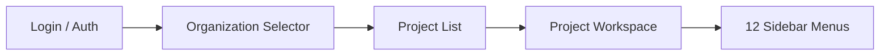
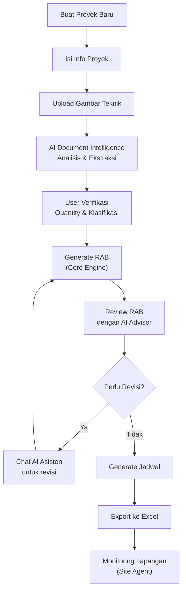

# PAAX AI — Dashboard Blueprint

> Dokumen ini menjelaskan struktur lengkap workspace dashboard PAAX AI v0.3,
> termasuk 12 menu sidebar, AI agent yang terlibat, dan prioritas MVP.

---

## 1. Overview

PAAX AI workspace adalah **project-centric dashboard** untuk insinyur sipil Indonesia.
Setiap proyek konstruksi memiliki workspace sendiri dengan akses ke semua fitur:
RAB (Rencana Anggaran Biaya), jadwal pelaksanaan, analisis gambar teknik,
dan monitoring lapangan.



---

## 2. Sidebar Menu Structure

| # | Menu Name | Icon | Route | Purpose | AI Agent | MVP Priority |
|---|-----------|------|-------|---------|----------|--------------|
| 1 | **Dashboard** | `LayoutDashboard` | `/project/:id` | Ringkasan proyek: progress RAB, jadwal, notifikasi | — | P0 |
| 2 | **Dokumen Proyek** | `FileStack` | `/project/:id/documents` | Upload & kelola gambar teknik, spesifikasi, kontrak | Document Intelligence | P0 |
| 3 | **RAB** | `Calculator` | `/project/:id/rab` | Buat & kelola Rencana Anggaran Biaya | Core Engine + RAB Advisor | P0 |
| 4 | **AHSP** | `BookOpen` | `/project/:id/ahsp` | Analisa Harga Satuan Pekerjaan — database & custom | Core Engine | P0 |
| 5 | **Harga Material** | `Package` | `/project/:id/rates` | Database harga material, upah, dan alat per wilayah | Core Engine | P0 |
| 6 | **Jadwal** | `CalendarDays` | `/project/:id/schedule` | Jadwal pelaksanaan (Gantt chart, critical path) | Schedule Advisor | P1 |
| 7 | **Gambar Teknik** | `Ruler` | `/project/:id/drawings` | Viewer gambar + AI extraction dari PDF/CAD | Drawing Understanding | P1 |
| 8 | **Asisten AI** | `Bot` | `/project/:id/assistant` | Engineering chat — tanya jawab teknis & revisi | AI Orchestrator (Engineering Chat) | P0 |
| 9 | **Laporan Lapangan** | `HardHat` | `/project/:id/site` | Daily report, progress foto, issue tracking | Site Agent | P2 |
| 10 | **Export** | `Download` | `/project/:id/export` | Export RAB, jadwal, laporan ke Excel/PDF | Core Engine (Export) | P1 |
| 11 | **Tim & Akses** | `Users` | `/project/:id/team` | Kelola anggota tim dan permission per proyek | — | P1 |
| 12 | **Pengaturan** | `Settings` | `/project/:id/settings` | Konfigurasi proyek: lokasi, mata uang, SNI version | — | P1 |

### Priority Legend

| Priority | Meaning | Target Release |
|----------|---------|----------------|
| **P0** | Must have for MVP launch | v0.3.0 |
| **P1** | Required for beta | v0.4.0 |
| **P2** | Enhancement | v0.5.0+ |

---

## 3. AI Agents Overview

Setiap agent memiliki tanggung jawab spesifik dan tidak saling tumpang tindih:

### 3.1 Core Engine (Deterministic)
- **Teknologi**: FastAPI (Python)
- **Fungsi**: Kalkulasi RAB, AHSP lookup, schedule CPM, export Excel
- **Prinsip**: 100% deterministik, tidak menggunakan LLM untuk perhitungan angka

### 3.2 AI Orchestrator (Genkit)
- **Teknologi**: Firebase Genkit (TypeScript)
- **Fungsi**: Routing chat, tool calling, multi-agent coordination
- **Flows**: `engineering-chat`, `rab-advisor`, `schedule-advisor`, `drawing-understanding`

### 3.3 Document Intelligence
- **Teknologi**: Cloud Functions + Gemini Vision
- **Fungsi**: PDF processing, OCR, gambar teknik classification, quantity extraction
- **Pipeline**: Upload → Split → OCR → Classify → Vision Analysis → Candidates

### 3.4 Site Agent
- **Teknologi**: Cloud Functions + Gemini
- **Fungsi**: Analisis laporan harian, progress tracking, anomaly detection
- **Input**: Foto lapangan, daily report text, cuaca

---

## 4. Dashboard Page Layout

```
┌──────────────────────────────────────────────────────────────┐
│  PAAX AI          [Organization ▼]    [🔔] [👤 Profile]      │
├──────────┬───────────────────────────────────────────────────┤
│          │                                                   │
│ SIDEBAR  │  MAIN CONTENT AREA                                │
│          │                                                   │
│ Dashboard│  ┌─────────────┐ ┌─────────────┐ ┌────────────┐  │
│ Dokumen  │  │ Progress RAB│ │ Jadwal      │ │ AI Insights│  │
│ RAB      │  │ ██████░░ 75%│ │ On Track ✅ │ │ 3 saran    │  │
│ AHSP     │  └─────────────┘ └─────────────┘ └────────────┘  │
│ Harga    │                                                   │
│ Jadwal   │  ┌────────────────────────────────────────────┐   │
│ Gambar   │  │ Recent Activity                            │   │
│ Asisten  │  │ • RAB v3 di-generate — 2 jam lalu          │   │
│ Laporan  │  │ • Gambar denah lantai 2 di-upload          │   │
│ Export   │  │ • Jadwal scenario B dibuat                  │   │
│ Tim      │  └────────────────────────────────────────────┘   │
│ Settings │                                                   │
│          │  ┌────────────────────────────────────────────┐   │
│          │  │ Quick Actions                              │   │
│          │  │ [+ Upload Gambar] [Generate RAB] [Chat AI] │   │
│          │  └────────────────────────────────────────────┘   │
│          │                                                   │
└──────────┴───────────────────────────────────────────────────┘
```

---

## 5. Workflow: Project Creation to Export



### Step-by-step:

1. **Buat Proyek** — User mengisi nama proyek, lokasi (kabupaten/kota), tipe bangunan, dan informasi kontrak
2. **Upload Dokumen** — Gambar teknik (PDF/DWG), spesifikasi teknis, dokumen kontrak
3. **AI Extraction** — Document Intelligence memproses gambar: OCR, klasifikasi (denah/potongan/detail), ekstraksi dimensi
4. **Verifikasi User** — User me-review hasil ekstraksi AI, koreksi jika perlu (human-in-the-loop)
5. **Generate RAB** — Core Engine menghitung RAB berdasarkan volume terverifikasi × AHSP × harga satuan
6. **Review AI** — RAB Advisor memberikan insight: perbandingan benchmark, potensi penghematan, item yang perlu dicek
7. **Revisi (opsional)** — Jika ada revisi, user bisa chat dengan AI Asisten untuk diskusi teknis
8. **Jadwal** — Generate jadwal pelaksanaan dari item RAB, dengan dependensi dan durasi
9. **Export** — Export RAB dan jadwal ke format Excel (template standar)
10. **Monitoring** — Site Agent untuk tracking progress harian di lapangan

---

## 6. Page Specifications

### 6.1 Dashboard (`/project/:id`)
- **Cards**: Progress RAB (%), Status Jadwal, Jumlah Dokumen, AI Insights count
- **Recent Activity**: Timeline aktivitas terbaru
- **Quick Actions**: Shortcut ke fitur utama
- **Notifications**: Alert dari Site Agent dan AI

### 6.2 Dokumen Proyek (`/project/:id/documents`)
- **File Grid/List**: Semua file yang di-upload
- **Upload Zone**: Drag & drop atau browse
- **Processing Status**: Badge per file (processing/ready/error)
- **Preview**: In-app PDF/image viewer

### 6.3 RAB (`/project/:id/rab`)
- **Version Selector**: Dropdown versi RAB
- **Table View**: Hierarki pekerjaan (Divisi → Sub-divisi → Item)
- **Summary Cards**: Total biaya, jumlah item, rata-rata harga satuan
- **Actions**: Generate, Recalculate, Optimize, Export
- **AI Panel**: Side panel RAB Advisor suggestions

### 6.4 Asisten AI (`/project/:id/assistant`)
- **Chat Interface**: Conversational UI
- **Context Panel**: Dokumen/RAB yang sedang dibahas
- **Tool Indicators**: Badge ketika AI menggunakan tool (kalkulasi, lookup, dll.)
- **Suggested Prompts**: Quick prompt suggestions

---

## 7. Responsive Design

| Breakpoint | Layout |
|------------|--------|
| Desktop (≥1280px) | Sidebar expanded + main content + optional side panel |
| Tablet (768–1279px) | Sidebar collapsed (icons only) + main content |
| Mobile (<768px) | Bottom navigation bar + full-width content |

---

## 8. Navigation State

```typescript
// apps/web/src/stores/navigation.ts
interface NavigationState {
  currentProjectId: string | null;
  activeMenu: SidebarMenu;
  sidebarCollapsed: boolean;
  breadcrumbs: Breadcrumb[];
}

type SidebarMenu =
  | 'dashboard'
  | 'documents'
  | 'rab'
  | 'ahsp'
  | 'rates'
  | 'schedule'
  | 'drawings'
  | 'assistant'
  | 'site'
  | 'export'
  | 'team'
  | 'settings';
```

---

*Dokumen ini adalah living document dan akan di-update seiring perkembangan v0.3.*
