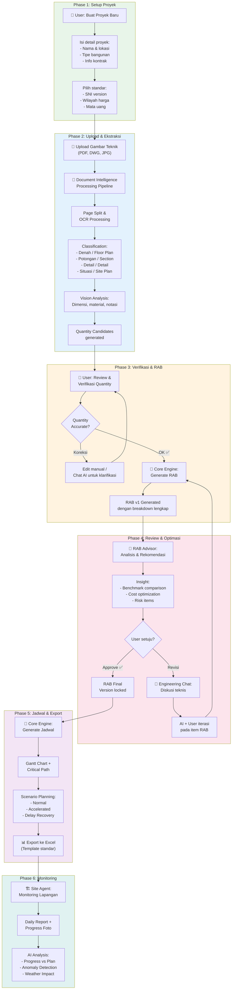
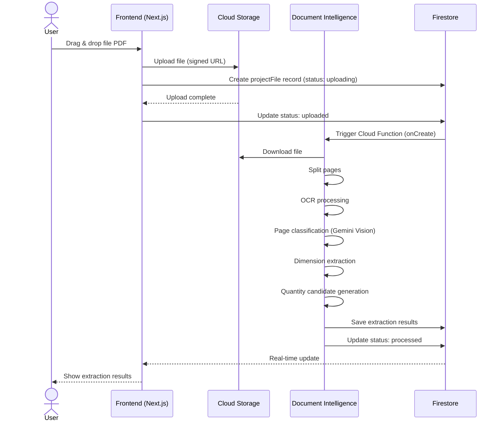
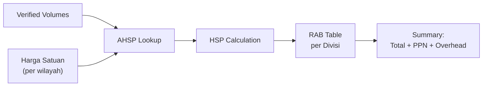
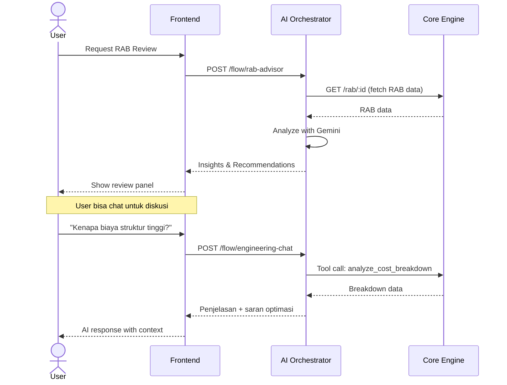
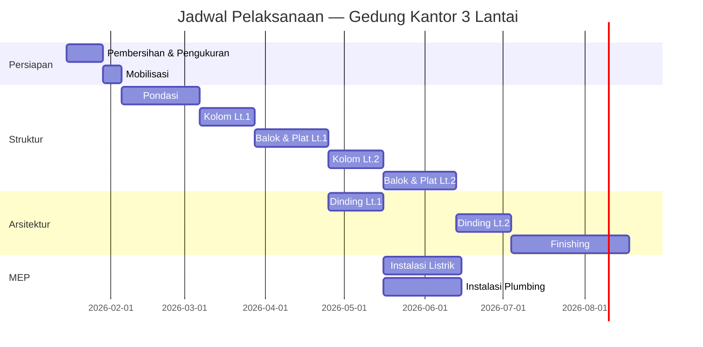
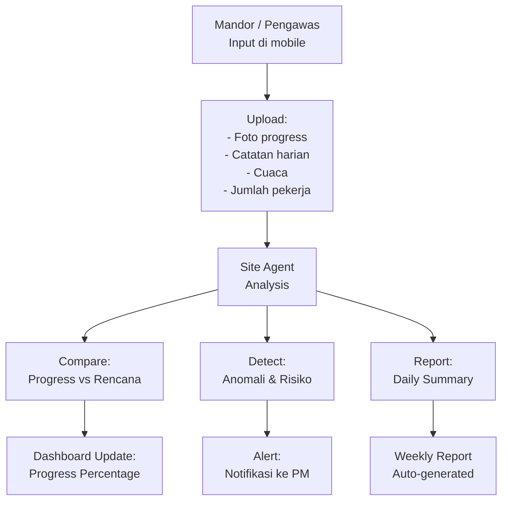

# PAAX AI — Workflow Documentation

> Dokumen ini menjelaskan alur kerja lengkap pengguna PAAX AI,
> dari pembuatan proyek hingga monitoring lapangan.

---

## 1. End-to-End Workflow Overview



---

## 2. Phase 1: Setup Proyek

### 2.1 Buat Proyek Baru

User mengisi form pembuatan proyek dengan informasi berikut:

| Field | Type | Required | Example |
|-------|------|----------|---------|
| `namaProyek` | string | ✅ | "Gedung Kantor 3 Lantai" |
| `lokasi.provinsi` | string | ✅ | "Jawa Barat" |
| `lokasi.kabupaten` | string | ✅ | "Kota Bandung" |
| `lokasi.koordinat` | GeoPoint | ❌ | { lat: -6.9175, lng: 107.6191 } |
| `tipeBangunan` | enum | ✅ | "gedung_komersial" |
| `luasBangunan` | number (m²) | ❌ | 1500 |
| `jumlahLantai` | number | ❌ | 3 |
| `nilaiKontrak` | number (IDR) | ❌ | 15000000000 |
| `tanggalMulai` | date | ❌ | 2026-01-15 |
| `tanggalSelesai` | date | ❌ | 2026-12-31 |
| `standarSNI` | string | ✅ | "SNI 2023" |
| `wilayahHarga` | string | ✅ | "Kota Bandung 2026" |

### 2.2 Tipe Bangunan yang Didukung

```typescript
type TipeBangunan =
  | 'rumah_tinggal'        // Rumah tinggal 1-2 lantai
  | 'rumah_bertingkat'     // Rumah > 2 lantai
  | 'gedung_komersial'     // Kantor, retail
  | 'gedung_pemerintah'    // Bangunan pemerintah
  | 'gedung_pendidikan'    // Sekolah, kampus
  | 'gedung_kesehatan'     // Rumah sakit, klinik
  | 'gudang_industri'      // Gudang, pabrik
  | 'infrastruktur_jalan'  // Jalan, jembatan
  | 'infrastruktur_air'    // Drainase, irigasi
  | 'lainnya';             // Custom
```

---

## 3. Phase 2: Upload & AI Extraction

### 3.1 Upload Flow



### 3.2 Document Classification Categories

| Category | Indonesian | Description | AI Confidence Threshold |
|----------|-----------|-------------|------------------------|
| `floor_plan` | Denah | Tampak atas per lantai | 0.85 |
| `section` | Potongan | Potongan melintang/memanjang | 0.80 |
| `elevation` | Tampak | Tampak depan/samping/belakang | 0.85 |
| `detail` | Detail | Detail konstruksi (tulangan, sambungan) | 0.75 |
| `site_plan` | Situasi | Denah lokasi dan lingkungan | 0.80 |
| `structural` | Struktur | Gambar struktur (kolom, balok, plat) | 0.80 |
| `mep` | MEP | Mekanikal, elektrikal, plumbing | 0.75 |
| `schedule_table` | Tabel | Tabel pintu/jendela, finishing | 0.70 |
| `specification` | Spesifikasi | Dokumen spesifikasi teknis | 0.80 |
| `unknown` | Tidak dikenal | Tidak dapat diklasifikasi | — |

### 3.3 Extraction Output

Untuk setiap halaman yang diproses, Document Intelligence menghasilkan:

```json
{
  "pageNumber": 3,
  "classification": "floor_plan",
  "confidence": 0.92,
  "extractedData": {
    "dimensions": [
      { "label": "Ruang Tamu", "length": 6.0, "width": 4.0, "unit": "m" },
      { "label": "Kamar Tidur 1", "length": 4.0, "width": 3.5, "unit": "m" }
    ],
    "materials": ["bata ringan", "beton K-300", "baja tulangan"],
    "notations": ["skala 1:100", "elevasi +0.00"],
    "quantityCandidates": [
      {
        "item": "Pekerjaan Dinding Bata Ringan",
        "volume": 85.5,
        "unit": "m²",
        "source": "auto-calculated",
        "confidence": 0.78,
        "verificationNeeded": true
      }
    ]
  }
}
```

---

## 4. Phase 3: Verifikasi & RAB Generation

### 4.1 Human-in-the-Loop Verification

Prinsip utama PAAX AI: **AI assists, human decides.**

User mendapat tabel verifikasi:

| Item Pekerjaan | Volume AI | Satuan | Confidence | Status | Aksi |
|----------------|-----------|--------|------------|--------|------|
| Galian tanah pondasi | 45.6 | m³ | 🟢 92% | Auto-approved | [Edit] |
| Pasangan bata ringan | 85.5 | m² | 🟡 78% | Perlu verifikasi | [Verify] [Edit] |
| Pekerjaan atap baja | — | kg | 🔴 < 60% | Manual input | [Input] |

**Rules:**
- Confidence ≥ 85%: Auto-approved (tapi tetap bisa di-edit)
- Confidence 60-84%: Perlu verifikasi manual
- Confidence < 60%: Harus input manual

### 4.2 RAB Generation

Setelah volume terverifikasi, Core Engine menghitung RAB:

```
Total Biaya Item = Volume × Harga Satuan Pekerjaan (HSP)

HSP = Σ (koefisien_material × harga_material)
    + Σ (koefisien_upah × harga_upah)
    + Σ (koefisien_alat × harga_alat)
```



### 4.3 RAB Output Structure

```
RAB Proyek: Gedung Kantor 3 Lantai
├── Divisi 1: Pekerjaan Persiapan
│   ├── 1.1 Pembersihan Lahan ........... Rp 15.000.000
│   ├── 1.2 Pengukuran & Bouwplank ...... Rp  8.500.000
│   └── 1.3 Direksi Keet ................ Rp 25.000.000
├── Divisi 2: Pekerjaan Tanah
│   ├── 2.1 Galian Tanah Pondasi ........ Rp 32.400.000
│   └── 2.2 Urugan Pasir ................ Rp 18.200.000
├── Divisi 3: Pekerjaan Struktur
│   ├── 3.1 Pondasi ..................... Rp 245.000.000
│   ├── 3.2 Kolom ....................... Rp 180.000.000
│   ├── 3.3 Balok ....................... Rp 210.000.000
│   └── 3.4 Plat Lantai ................ Rp 165.000.000
├── ...
└── TOTAL (sebelum PPN) ................ Rp 4.850.000.000
    PPN 11% ............................ Rp   533.500.000
    GRAND TOTAL ........................ Rp 5.383.500.000
```

---

## 5. Phase 4: Review & Optimization

### 5.1 RAB Advisor Flow



### 5.2 Engineering Chat Capabilities

Asisten AI bisa membantu dengan:

- **Klarifikasi teknis**: "Apa perbedaan beton K-300 dan K-350?"
- **Analisis biaya**: "Breakdown biaya pekerjaan struktur"
- **Optimasi**: "Carikan alternatif material yang lebih murah"
- **Standar**: "Apakah tebal plat 12cm sudah sesuai SNI?"
- **Revisi RAB**: "Ubah volume galian tanah menjadi 50 m³"
- **Perbandingan**: "Bandingkan harga material Bandung vs Jakarta"

---

## 6. Phase 5: Jadwal & Export

### 6.1 Schedule Generation

Core Engine menggenerate jadwal dari item RAB:



### 6.2 Scenario Planning

User bisa membuat multiple scenario:

| Scenario | Durasi | Biaya Tambahan | Risk Level |
|----------|--------|----------------|------------|
| Normal | 12 bulan | — | Low |
| Accelerated | 9 bulan | +15% overtime | Medium |
| Delay Recovery | 13 bulan | +8% overhead | Medium |

### 6.3 Excel Export

Export menggunakan **template tetap** (bukan LLM-generated):

```
📊 Export Output:
├── RAB_GedungKantor_v3.xlsx
│   ├── Sheet 1: Rekapitulasi (Summary)
│   ├── Sheet 2: RAB Detail (per item)
│   ├── Sheet 3: AHSP (Analisa Harga Satuan)
│   ├── Sheet 4: Daftar Harga Material
│   └── Sheet 5: Daftar Harga Upah
├── Jadwal_GedungKantor_v1.xlsx
│   ├── Sheet 1: Gantt Chart
│   ├── Sheet 2: S-Curve
│   └── Sheet 3: Resource Loading
└── Laporan_AI_Review.pdf
```

---

## 7. Phase 6: Site Monitoring

### 7.1 Daily Report Flow



### 7.2 Site Agent Capabilities

- **Progress Tracking**: Bandingkan realisasi vs rencana per item pekerjaan
- **Photo Analysis**: Gemini Vision menganalisis foto untuk validasi progress
- **Weather Impact**: Prediksi dampak cuaca terhadap jadwal
- **Safety Check**: Deteksi potensi masalah keselamatan dari foto
- **Auto Reporting**: Generate laporan mingguan otomatis

---

## 8. Error Handling & Edge Cases

| Scenario | Handling |
|----------|----------|
| Upload file corrupt | Tampilkan error, minta re-upload |
| AI extraction gagal | Fallback ke manual input, log error |
| Harga material tidak ditemukan | Gunakan harga terdekat + warning |
| AHSP tidak tersedia | Sarankan custom AHSP atau pilih alternatif |
| Network error saat chat | Queue message, retry otomatis |
| Concurrent edit RAB | Optimistic locking dengan version check |

---

*Dokumen ini menjelaskan workflow ideal. Edge cases dan error handling akan di-detail-kan di dokumen terpisah.*
