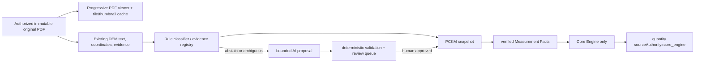

# Drawing Intelligence Feedback Remediation Design

**Status:** approved for implementation by the user's explicit mandate; execute only through the reviewed subsystem plans and PR gate.

## Decision

Adopt an incremental evidence-first remediation. Preserve the original authorized PDF as the viewer source; derive only low-resolution thumbnails separately. Carry evidence through DEM, PCKM and reviewed measurement facts into existing Core Engine endpoints. An AI proposal may classify or bind already-extracted text and coordinates only after the deterministic path abstains; it cannot create a final number, alter an engine result, or bypass human approval.

This is preferred over (a) copying OpenTakeoff wholesale, which would create a divergent product and Apache-2.0 attribution/notice obligations, and (b) a new YOLO/DETR training programme, which is not justified until deterministic evidence coverage shows a repeatable detection gap. PAAX may adapt the OpenTakeoff patterns of tile pyramid, worker pool, viewport prioritisation and byte-bounded LRU cache. Any copied source requires retained copyright and Apache-2.0 NOTICE/Licence compliance; this scope plans a clean-room implementation of patterns rather than source copying.

## Architecture and non-negotiable boundaries

* The source PDF page order and page numbers are immutable; view grouping is a derived index only.
* `sourceAuthority: core_engine` is required for a calculated/final quantity. `measurement_fact` may display a verified measurement but cannot be represented as a computed total. `none` is review-only.
* Existing deterministic takeoff remains the first target: `/tkg/takeoff` for `beton`, `bekisting`, `besi`; `/takeoff/{tanah,dinding,arsitektur,baja,atap,kusen,mep,mep-advanced,smkk}` through the existing bridges. Unsupported input/endpoint combinations are explicit `blocked/review`, never zeroes, templates, invented formulae or dummy values.
* AI gets bounded text, coordinate/evidence references and an allowed vocabulary. It returns a proposal with confidence and citations, is deterministically checked, placed in review, and is never auto-committed to engine input.
* Live model calls are prohibited from normal tests. The later controlled benchmark has an immutable cap of 30 calls: 15 DeepSeek V4 Pro and 15 Qwen 3.7 Plus, using only `DRAWING_INTELLIGENCE_API_KEY` from runtime configuration; it does not reprocess the 88-page PLHUT source.

## Viewer design

The server continues to authorize the original artifact by project/run/signature. It adds a correctly tested HTTP `Range`, `If-None-Match`/`ETag`, `Accept-Ranges`, `Content-Length` and `206`/`304` contract, forwarding no unauthorised bytes. The Next proxy must preserve those headers and stream rather than buffer. pdf.js loads the original PDF progressively. A worker-pool tile renderer keeps the main thread responsive, prioritises visible tiles, releases `ImageBitmap`s on LRU eviction, and uses a fixed byte budget. The minimap is optional, draggable, minimisable and closable; its toggle is in the top sidebar. Thumbnails are dedicated low-resolution images and never substitute for the source page.

`RealPageSvg` is retired from the main-page render path because its `preserveAspectRatio="none"` stretches documents. The replacement uses pdf.js/page geometry with `preserveAspectRatio="xMidYMid meet"`; overlays use the same aspect-preserving transform. `TechnicalStatusBar` receives a total status-message normalizer so Takeoff, Mission and Handoff cannot call string methods on `undefined`.

The proxy boundary is explicit: `/api/document-intelligence/*` owns authorised original artifacts, thumbnails, DEM run/page intelligence and review operations; `/api/drawing-intelligence/*` proxies DB/PCKM graph, coverage and RAB-readiness resources. This prevents a DB proxy from becoming an artifact transport path and retains the existing internal-key boundary.

## Classification/index design

Every page receives a `SheetSemanticProfile` with immutable source index, deterministic drawing classification, normalized level, confidence and evidence. Three derived views are: level (site, foundation, L1..Ln, roof, detail, section, elevation, schedule), classification (cover, drawing list, site plan, plan, elevation, section, detail, schedule, diagram, technical note) with level ordering within categories, and original source order. The deterministic classifier handles known values first. An unknown/ambiguous page remains visibly unassigned with its reason, then can receive a validated AI *proposal*; a novel category is reviewable metadata, not a hard-coded project-specific rule.

## Quantity, agentic and audit design

The quantity delivery must inventory each candidate's evidence, required inputs, compatible Core Engine endpoint, actual engine response and source page. The UI hides formula expressions and shows concise source page labels. The handoff is unavailable until all included lines have `core_engine` authority and no unresolved evidence conflict. Existing mission and handoff interfaces become backed by durable agent-run/approval records, budgets and idempotency keys. The agent can request bounded tools and prepare proposals, but a human approval is mandatory before mutations or any Engine call that materialises a result.

Opening a workspace loads only sheets/runs/summary. Selecting a sheet triggers a project-scoped, page-indexed graph/evidence request; review overlays fetch the same active-sheet payload. It never retrieves an entire graph on open. The coverage response is lossless: every DEM/PCKM/consolidated-registry candidate appears exactly once, either as engine-ready/calculated or explicit `blocked/review`.

No production module imports `di-mock-data.ts`, hard-coded file-size/aggregate claims, or synthetic thumbnail sources. Test-only fixtures remain isolated under test directories. A CI source scan makes a production import or literal claim a failure.

## Acceptance and feedback traceability

| Feedback paragraph(s) | Required acceptance evidence |
|---|---|
| P2 | Real document initial-load timing captured; visible first page is responsive without pre-rendering all pages. |
| P3 | Original aspect ratio/sharp detail, progressive range loading, bounded cache, draggable/minimise/close/toggle minimap, and browser inspection. |
| P4 | Takeoff route opens and submits a real backend-backed draft without runtime crash. |
| P5 | Evidence-to-PCKM-to-engine coverage report distinguishes column, beam, wall, foundation and MEP; no dummy/template result; only existing formula contracts used. |
| P6 | Mission opens, recovers from backend failure, and records durable run state. |
| P7 | Handoff lists only real authority-gated rows and rejects unsupported/unverified rows. |
| P8 | Universal deterministic sheet indexing plus real low-resolution thumbnails for the 53-page architecture fixture. |
| P9-P27 | Level view contains site, foundation, floors, roof, detail, section, elevation and schedule in defined canonical order when present. |
| P28-P48 | Classification view has all requested categories, and orders each category by canonical level. |
| P49-P57 | Original view reproduces immutable document source order and page numbering. |
| P58 | AI is called only after deterministic abstention; novel category is a reviewable proposal. |
| P59 | Review UI gives reason, evidence, resolution state and manual path for every missed/unexplained item. |
| P60 | Quantity UI exposes concise source page labels, not formula text or long source blobs. |
| P61 | Sidebar removes analysed-file noise, clearly labels the three views, and replaces ambiguous level tree with selected view navigation. |
| P62 | Offline first, controlled 15+15 benchmark later; no PLHUT 88-page re-analysis; audit includes model/case/prompt version/tokens/cost/latency/proposal/validation/outcome. Documentation explains OCR, bbox, annotation, YOLO/DETR decision and agentic boundaries. |

## Test gates

1. Unit and integration tests use local fixtures, fake clients and network guards.
2. Browser E2E starts the actual web, document-intelligence and Core Engine services with the 53-page architecture PDF; it validates backend responses, source authority and visual modes, not snapshots alone.
3. Manual browser visual inspection at desktop and narrow viewport records the viewer, sheets, takeoff, quantities, mission and handoff modes.
4. The controlled live benchmark is authorised after offline and browser gates pass. A persisted ledger rejects call 31 and any PLHUT 88-page source.
5. Final audit maps every paragraph P2-P62 to test/report evidence before PR handoff.

### Performance protocol and thresholds

Before viewer implementation, the same laptop/browser/profile records three cold and three warm runs of the 53-page architecture PDF. The median values are committed as `apps/web/e2e/fixtures/performance-baseline.json`, along with browser version, DPR, viewport, device memory/hardware-concurrency and fixture SHA-256. Acceptance is measurable: median cold first contentful page paint is at most 70% of baseline; warm first page paint is at most 50% of baseline; pan p95 frame interval is at most 16.7ms; no pan long task exceeds 50ms; tile-cache accounted bytes never exceed 96MiB; and measured JS-heap delta after the scripted open/pan/zoom sequence is at most 96MiB. The report records raw measurements and pass/fail comparisons rather than a qualitative speed claim.

### Baseline evidence and regression rule

The present targeted foundations are retained but are not acceptance proof: document-intelligence has 49 focused tests passing, Core Engine takeoff/TKG/PLHUT anchor tests have 67 passing, and the web DI targeted suite has 21 passing tests across five files. The observed slow/stretched viewer, missing real thumbnails, Takeoff/Mission failure and incomplete handoff are therefore gaps in coverage. Each subsystem plan begins by adding a regression that fails on the current behaviour, then makes that precise test pass; an already-green snapshot or mocked component test cannot close a feedback row by itself. The 53-page architecture PDF is viewer/sheet-classification data only; existing PLHUT PDF plus DEM/PCKM artifacts are read-only quantity/engine evidence only and the plan never invokes their transcription pipeline.

## Deliberately deferred / blocked

No new engineering formula is designed here. A category for which the evidence registry cannot produce the exact required input fields and no existing Core Engine contract accepts them must remain `blocked/review` with a clear reason. Whether to add formulae is a domain decision for Claude/owner, with manual anchors and synchronized Pydantic/Zod schema work.

